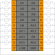

# Модуль аналогового ввода тока SA-P5-AIC

## Общие сведения

??? example "Тестирование"
    На текущий момент модуль на стадии тестирования. Серийный выпуск запланирован на декабрь 2025 года 

<div class="grid cards" markdown>

{ width="150" align=left  }
Модуль аналогового ввода тока AIC (арт. SA-P5-AIC) является 16-ти канальным модулем расширения и предназначен для приема сигналов по интерфейсу «токовая петля».
</div>

## Технические характеристики 
| Характеристика                          | Значение                          |
|-----------------------------------------|-----------------------------------|
| Количество каналов                      | 16                                |
| Диапазон измерения тока, мА             | от 0,01 до 22,00                  |
| Приведенная погрешность измерения, %    | 0,035                             |
| Наличие индикации каждого канала        | да                                |
| Наличие индикации питания, канала информационного обмена|да                 |
| Напряжение питание, В                   | от 19 до 29                       |
| Номинальное напряжение питания, В       | 24                                |
| Потребляемая мощность, Вт               | 4                                 |
| Гальваническая изоляция                 | Между входной и выходной логикой  |
| Сечение проводника, мм²                 | От 0,2 до 1,5                     |
| Масса, кг                               | 0,12                              |
| Размеры (Ш х В х Г), мм                 | 21,8х130,9x98,0                   |

## Эксплуатационные характеристики
| Характеристика                   | Значение           |
| -------------------------------- | -                  |
| Температура эксплуатации, °С     | От минус 40 до 60  |
| Температура хранения, °С         | От минус 40 до 60  |
| Влажность при хранении, %	       | От 5 до 95         |
| Влажность при эксплуатации, %    | От 5 до 95         |
| Тип монтажа                      | На DIN-рейку 35 мм |
| Расположение при монтаже         | Вертикальное       |

## Схема подключения

<div class="grid cards" markdown>
{ width="370"; align=left  }

{ width="170";  }
</div>

| Обозначение | Название канала | Описание                       |
|-------------|-----------------|--------------------------------|
| 1 - 16      | AI1 - AI16      | Входной канал 1 - 16          |
| 17, 18          | GND             | Общий контакт |

## Индикация
| Обозначение | Индикация | Показатель |
|------------------|----------------------|---------------------------------------|
| P | :green_circle:| Наличие напряжения питания |
| P | :white_circle:| Отсутствие напряжения питания |
| L | :green_circle:| Наличие соединения Ethernet |
| L | :yellow_circle: :green_circle: :yellow_circle: | Обмен данными по Ethernet |
| L | :white_circle:| Отсутствие соединения Ethernet|
| 1-16 | :green_circle:| Ток канала больше заданного (по умолчанию 4 мА)  |
| 1-16 | :white_circle:| Ток канала меньше заданного (по умолчанию 4 мА) |

## Размеры

=== "Габаритные размеры" 
    { width="580"  }
=== "Установочные размеры"
     

## 3D-модель
<model-viewer src="https://manual.saplc.ru//img/3d/DI.glb"
alt="3D Model"
auto-rotate
camera-controls
poster="https://manual.saplc.ru//img/3d/posterDI.webp"
camera-orbit="160deg 75deg 348m"
field-of-view="30deg"
exposure="0.5"
style="width: 100%; height: 500px;">
</model-viewer>

## Программное обеспечение
Обмен данными осуществляется с использованием объектов PDO (Process Data Objects) для оперативной передачи входных данных и SDO (Service Data Objects) для настройки параметров и получения статуса каналов.

### PDO (Process Data Objects)
PDO используются для передачи данных в реальном времени. Модуль предоставляет 16 входных каналов, значения которых передаются через структуру "Inputs". Каждый канал измеряет ток в заданном диапазоне, определяемом настройками в SDO.

Структура PDO:
```
|─ Inputs
     |─ Channel 1 (Входной канал 1)
     |─ Channel 2 (Входной канал 2)
     |─ Channel 3 (Входной канал 3)
     |─ Channel 4 (Входной канал 4)
     |─ Channel 5 (Входной канал 5)
     |─ Channel 6 (Входной канал 6)
     |─ Channel 7 (Входной канал 7)
     |─ Channel 8 (Входной канал 8)
     |─ Channel 9 (Входной канал 9)
     |─ Channel 10 (Входной канал 10)
     |─ Channel 11 (Входной канал 11)
     |─ Channel 12 (Входной канал 12)
     |─ Channel 13 (Входной канал 13)
     |─ Channel 14 (Входной канал 14)
     |─ Channel 15 (Входной канал 15)
     |─ Channel 16 (Входной канал 16)
```

* **Назначение:** Передача измеренных значений тока с каждого из 16 каналов.
* ***Формат данных:*** 32-битное значение с плавающей точкой (float), обеспечивающее высокую точность измерений.
### SDO (Service Data Objects)
SDO используются для конфигурации модуля и диагностики состояния каналов. Структура SDO включает два основных раздела: настройки (Settings) и статус (Status).

Структура SDO:

```
|─ Settings
|     |─ Channel 1
|     |     |─ Input type
|     |     |     |─ 4-20 mA (Ток от 4 до 20 мА)
|     |     |     |─ 0-20 mA (Ток от 0 до 20 мА)
|     |     |     |─ 0-5 mA (Ток от 0 до 5 мА)
|     |     |     |─ Disable (Отключено) — значение по умолчанию
|     |     |─ Average samples (Среднее количество выборок)
|     |─ Channel 2 (аналогично)
|     |─ Channel 3 (аналогично)
|     |─ Channel 4 (аналогично)
|     |─ Channel 5 (аналогично)
|     |─ Channel 6 (аналогично)
|     |─ Channel 7 (аналогично)
|     |─ Channel 8 (аналогично)
|     |─ Channel 9 (аналогично)
|     |─ Channel 10 (аналогично)
|     |─ Channel 11 (аналогично)
|     |─ Channel 12 (аналогично)
|     |─ Channel 13 (аналогично)
|     |─ Channel 14 (аналогично)
|     |─ Channel 15 (аналогично)
|     |─ Channel 16 (аналогично)
|
|─ Status
|     |─ Channel 1
|     |     |─ Status (Битовое поле)
|     |─ Channel 2 (аналогично)
|     |─ Channel 3 (аналогично)
|     |─ Channel 4 (аналогично)
|     |─ Channel 5 (аналогично)
|     |─ Channel 6 (аналогично)
|     |─ Channel 7 (аналогично)
|     |─ Channel 8 (аналогично)
|     |─ Channel 9 (аналогично)
|     |─ Channel 10 (аналогично)
|     |─ Channel 11 (аналогично)
|     |─ Channel 12 (аналогично)
|     |─ Channel 13 (аналогично)
|     |─ Channel 14 (аналогично)
|     |─ Channel 15 (аналогично)
|     |─ Channel 16 (аналогично)
```

**Settings (Настройки):**  
**Input type:** Позволяет выбрать тип входного сигнала для каждого канала: 4-20 мА, 0-20 мА, 0-5 мА или отключить канал (Disable).  

???+ info "Примечание"
    При отключение канала скорость опроса других увеличивается.

**Average samples:** Настройка фильтрации методом "Скользящего среднего". Диапазон значений : от 1 (фильтрация выключена) до 255, по умолчанию — 16.  
**Status (Состояние):**
Отображает диагностическую информацию о состоянии каналов в виде битового поля:

|Номер бита|Описание|
|-|-|
|0|ток превышает допустимый диапазон|
|1|обрыв цепи|
|2|Зарезервирован|
|3|Зарезервирован|
|4|Зарезервирован|
|5|Зарезервирован|
|6|Зарезервирован|
|7|Зарезервирован|

### Принцип работы
**Конфигурация:** Через SDO задается тип входного сигнала (например, 4-20 мА) и ширина окна фильтрации для каждого канала.
**Измерение:** Через PDO в реальном времени передаются измеренные значения тока с каждого из 16 каналов в пределах заданного диапазона.
**Диагностика:** Через SDO можно запросить состояние каналов для выявления ошибок (перегрузка, обрыв и т.д.).
### Пример конфигурации
Установить Channel 1 в режим "4-20 mA" и ширину фильтрации 32 выборки через SDO.
Получить значение тока с Channel 1 через PDO (например, 12.5 мА).
Проверить состояние Channel 1 через SDO (Status), чтобы убедиться в отсутствии перегрузки или обрыва.

## Файлы для скачивания
<a href="/downloads/IPCSA_OG.xml" download>XML конфигурационный файл для TwinCAT</a>  
<a href="/downloads/AIC.c" download>Cstruct конфигурационный файл для IgH EtherCAT Master</a>     
<a href="/downloads/Module_18_pin.step" download>3D-модель</a>   
<a href="/downloads/Module_18_pin.dwg" download>2D-модель</a>    


