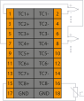

# Модуль аналогового ввода термопары SA-P5-AITC

## Общие сведения

??? example "Тестирование"
    На текущий момент модуль на стадии тестирования. Серийный выпуск запланирован на декабрь 2025 года 
<div class="grid cards" markdown>

{ width="150" align=left  }
Модуль аналогового ввода термопары (AITC) (арт. SA-P5-AITC) является 
8-ми канальным модулем расширения  и предназначен для приема сигналов от элементов измерения температуры.  
Модуль имеет 8 каналов измерения температуры от термопар.
</div>

## Технические характеристики 

| Характеристика                                       | Значение                          |
|------------------------------------------------------|-----------------------------------|
| Максимальная потребляемая мощность, Вт              | 5,5                               |
| Количество входных каналов термопар                 | 8                                 |
| Типы термопар                                        | R, S, B, J, T, E, K, N, A-1, A-2, A-3, L                     |
| Компенсация температуры холодного спая              | Внутренняя, Внешняя               |
| Время преобразования на все каналы, мс              | Не более 2-16                     |
| Относительная погрешность                                 | 2%                  |
| Разрядность АЦП, бит                                 | 24                                |
| Гальваническая изоляция                              | Между входной и выходной логикой  |
| Сечение проводника, мм²                              | От 0,2 до 1,5                     |
| Масса, г                                             | 120                               |
| Габариты ВхШхГ, мм                                   | 126х21,3х90                       |


## Эксплуатационные характеристики
| Характеристика                   | Значение           |
| -------------------------------- | -                  |
| Температура эксплуатации, °С     | От минус 40 до 60  |
| Температура хранения, °С         | От минус 40 до 60  |
| Влажность при хранении, %	       | От 5 до 95         |
| Влажность при эксплуатации, %    | От 5 до 95         |
| Тип монтажа                      | На DIN-рейку 35 мм |
| Расположение при монтаже         | Вертикальное       |

## Схема подключения

<div class="grid cards" markdown>
{ width="370"; align=left  }

{ width="170";  }
</div>

???+ note "Рекомендация"

    Используйте экранированный кабель, подключая экран к контакту GND только со стороны ПЛК. Это снизит влияние электромагнитных помех и предотвратит заземляющие петли


Допускается подключение экранирующей оплетки к нижним контактам «GND».


| Обозначение | Наименование канала | Описание                                    |
|-------------|---------------------|---------------------------------------------|
| 1           | TC1+               | Плюс термопары 1                             |
| 2           | TC1-               | Минус термопары 1                            |
| 3           | TC2+               | Плюс термопары 2                             |
| 4           | TC2-               | Минус термопары 2                            |
| 5           | TC3+               | Плюс термопары 3                             |
| 6           | TC3-               | Минус термопары 3                            |
| 7           | TC4+               | Плюс термопары 4                             |
| 8           | TC4-               | Минус термопары 4                            |
| 9           | TC5+               | Плюс термопары 5                             |
| 10          | TC5-               | Минус термопары 5                            |
| 11          | TC6+               | Плюс термопары 6                             |
| 12          | TC6-               | Минус термопары 6                            |
| 13          | TC7+               | Плюс термопары 7                             |
| 14          | TC7-               | Минус термопары 7                            |
| 15          | TC8+               | Плюс термопары 8                             |
| 16          | TC8-               | Минус термопары 8                            |
| 17          | GND                | Допускается подключение экранирующей оплетки |
| 18          | GND                | Допускается подключение экранирующей оплетки |

## Индикация
| Обозначение | Индикация | Показатель |
|------------------|----------------------|---------------------------------------|
| P | :green_circle:| Наличие напряжения питания |
| P | :white_circle:| Отсутствие напряжения питания |
| L | :green_circle:| Наличие соединения Ethernet |
| L | :yellow_circle: :green_circle: :yellow_circle: | Обмен данными по Ethernet |
| L | :white_circle:| Отсутствие соединения Ethernet|
| 1 - 8 | :green_circle:| Датчик 1 - 8 подключен |
| 1 - 8 | :white_circle:| Датчик 1 - 8 отключен |

## Размеры

=== "Габаритные размеры" 
    { width="580"  }
=== "Установочные размеры"
     

## 3D-модель
<model-viewer src="https://manual.saplc.ru//img/3d/DI.glb"
alt="3D Model"
auto-rotate
camera-controls
poster="https://manual.saplc.ru//img/3d/posterDI.webp"
camera-orbit="160deg 75deg 348m"
field-of-view="30deg"
exposure="0.5"
style="width: 100%; height: 500px;">
</model-viewer>

## Программное обеспечение
Обмен данными осуществляется с использованием объектов PDO (Process Data Objects) для оперативной передачи входных данных и SDO (Service Data Objects) для настройки параметров и получения статуса каналов.

### PDO (Process Data Objects)
PDO используются для передачи данных в реальном времени. Модуль предоставляет 8 входных каналов, значения которых передаются через структуру "Inputs". Каждый канал измеряет температуру в зависимости от настроек термопары, определяемых в SDO.

Структура PDO:
```
|─ Inputs
     |─ Channel 1 (Входной канал 1)
     |─ Channel 2 (Входной канал 2)
     |─ Channel 3 (Входной канал 3)
     |─ Channel 4 (Входной канал 4)
     |─ Channel 5 (Входной канал 5)
     |─ Channel 6 (Входной канал 6)
     |─ Channel 7 (Входной канал 7)
     |─ Channel 8 (Входной канал 8)
```

* **Назначение:** Передача измеренных значений температуры с каждого из 8 каналов
* ***Формат данных:*** 32-битное значение с плавающей точкой (float), обеспечивающее высокую точность измерений.
### SDO (Service Data Objects)
SDO используются для конфигурации модуля и диагностики состояния каналов. Структура SDO включает два основных раздела: настройки (Settings) и статус (Status).

Структура SDO:

```
|─ Settings
|     |─ Channel 1
|     |     |─ Enable / Disable
|     |     |     |─ Enable (Включено)
|     |     |     |─ Disable (Выключено) — значение по умолчанию
|     |     |─ Input type
|     |     |     |─ R (Термопара типа R)
|     |     |     |─ S (Термопара типа S)
|     |     |     |─ B (Термопара типа B)
|     |     |     |─ J (Термопара типа J)
|     |     |     |─ T (Термопара типа T)
|     |     |     |─ E (Термопара типа E)
|     |     |     |─ K (Термопара типа K)
|     |     |     |─ N (Термопара типа N)
|     |     |     |─ A-1 (Термопара типа A-1)
|     |     |     |─ A-2 (Термопара типа A-2)
|     |     |     |─ A-3 (Термопара типа A-3)
|     |     |     |─ L (Термопара типа L)
|     |     |─ Cold junction
|     |     |     |─ Interior (Внутренняя компенсация холодного спая)
|     |     |     |─ External (Внешняя компенсация холодного спая)
|     |     |─ Cold junction temperature (Температура холодного спая)
|     |     |─ Average samples (Среднее количество выборок)
|     |─ Channel 2 (аналогично)
|     |─ Channel 3 (аналогично)
|     |─ Channel 4 (аналогично)
|     |─ Channel 5 (аналогично)
|     |─ Channel 6 (аналогично)
|     |─ Channel 7 (аналогично)
|     |─ Channel 8 (аналогично)
|
|─ Status
|     |─ Channel 1
|     |     |─ Status (Битовое поле)
|     |─ Channel 2 (аналогично)
|     |─ Channel 3 (аналогично)
|     |─ Channel 4 (аналогично)
|     |─ Channel 5 (аналогично)
|     |─ Channel 6 (аналогично)
|     |─ Channel 7 (аналогично)
|     |─ Channel 8 (аналогично)
```

**Settings (Настройки):**  
**Enable / Disable:** Включение или выключение канала: Enable (Включено) или Disable (Выключено)  
???+ info "Примечание"
    При отключение канала скорость опроса других увеличивается.

**Input type:** Позволяет выбрать тип термопары для каждого канала: R, S, B, J, T, E, K, N, A-1, A-2, A-3 или L.

**Cold junction:** Выбор метода компенсации холодного спая: Interior (внутренняя) или External (внешняя).

**Cold junction** temperature: Указание температуры холодного спая для внешней компенсации (вводится вручную).

**Average samples:** Настройка фильтрации методом "Скользящего среднего". Диапазон значений : от 1 (фильтрация выключена) до 255, по умолчанию — 16.  
**Status (Состояние):**
Отображает диагностическую информацию о состоянии каналов в виде битового поля:

|Номер бита|Описание|
|-|-|
|0|Перегрузка|
|1|Обрыв|
|2|Отключен|
|3|Зарезервирован|
|4|Зарезервирован|
|5|Зарезервирован|
|6|Зарезервирован|
|7|Зарезервирован|

### Принцип работы
**Конфигурация:** Через SDO задается тип термопары (например, K), метод компенсации холодного спая и ширина окна фильтрации для каждого канала
**Измерение:** Через PDO в реальном времени передаются измеренные значения температуры с каждого из 8 каналов в зависимости от выбранного типа термопары  
**Диагностика:** Через SDO можно запросить состояние каналов для выявления ошибок (перегрузка, обрыв и т.д.)
### Пример конфигурации
Установить Channel 1 в режим "K" с внутренней компенсацией холодного спая и шириной фильтрации 32 выборки через SDO.  
Получить значение температуры с Channel 1 через PDO (например, 150.7 °C).  
Проверить состояние Channel 1 через SDO (Status), чтобы убедиться в отсутствии перегрузки или обрыва.

## Файлы для скачивания
<a href="/downloads/IPCSA_OG.xml" download>XML конфигурационный файл для TwinCAT</a>      
<a href="/downloads/Module_18_pin.step" download>3D-модель</a>   
<a href="/downloads/Module_18_pin.dwg" download>2D-модель</a>    


