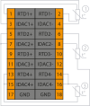

# Модуль аналогового ввода термосопротивления SA-P5-AITR

## Общие сведения

??? example "Тестирование"
    На текущий момент модуль на стадии тестирования. Серийный выпуск запланирован на декабрь 2025 года 
<div class="grid cards" markdown>

{ width="250" align=left  }
Модуль аналогового ввода термосопротивления (AITR) (арт. SA-P5-AITR) является 4-х канальным модулем расширения и предназначен для получения и обработки сигналов от терморезисторов.  
Схемотехникой модуля предусмотрено 2-х, 3-х и 4-х проводное подключение терморезисторов, а также разъемы для подключения экранирующей оплетки от подводящих кабелей с терморезисторов.
</div>

## Технические характеристики 
| Характеристика                          | Значение                          |
|-----------------------------------------|-----------------------------------|
| Количество каналов                      | 4                                 |
| Диапазон измерения сопротивления, Ом    | от 1 до 400                       |
| Приведенная погрешность измерения термосопротивления, %| 0,025              |
| Типы поддерживаемых термопреобразователей сопротивления| Pt50, Pt100, 50П, 100П,<br>50Н, 100Н, 50М, 100М  |
| Приведенная погрешность измерения температуры с термопреобразователей сопротивления, %                 | 0,04 |
| Наличие индикации каждого канала        | да                                |
| Наличие индикации питания, канала информационного обмена| да                |
| Напряжение питания, В                   | от 19 до 29                       |
| Номинальное напряжение питания, В       | 24                                |
| Потребляемая мощность, Вт, не более     | 2,5                               |
| Гальваническая изоляция                 | Между входной и выходной логикой  |
|Вес, кг, не более	                      | 0,12                              |
| Размеры (Ш х В х Г), мм                 | 21,8х130,9x98,0                   |

<div class="annotate" markdown>


</div>

1. :fontawesome-regular-face-laugh-wink: Характеристики соответствуют ГОСТ 6651-2009


## Эксплуатационные характеристики
| Характеристика                   | Значение           |
| -------------------------------- | -                  |
| Температура эксплуатации, °С     | От минус 40 до 60  |
| Температура хранения, °С         | От минус 40 до 60  |
| Влажность при хранении, %	       | От 5 до 95         |
| Влажность при эксплуатации, %    | От 5 до 95         |
| Тип монтажа                      | На DIN-рейку 35 мм |
| Расположение при монтаже         | Вертикальное       |

## Схема подключения

<div class="grid cards" markdown>
{ width="370"; align=left  }

{ width="170";  }
</div>

1 - 4-х проводное подключение  
2 - 3-х проводное подключение  
3 - 2-х проводное подключение
Рекомендуется использовать 4-х проводное подключение.

| Обозначение | Наименование канала | Описание                                   |
|-------------|---------------------|-------------------------------------------|
| 1           | TC1+               | Плюс термопары 1                          |
| 2           | TC1-               | Минус термопары 1                         |
| 3           | TC2+               | Плюс термопары 2                          |
| 4           | TC2-               | Минус термопары 2                         |
| 5           | TC3+               | Плюс термопары 3                          |
| 6           | TC3-               | Минус термопары 3                         |
| 7           | TC4+               | Плюс термопары 4                          |
| 8           | TC4-               | Минус термопары 4                         |
| 9           | TC5+               | Плюс термопары 5                          |
| 10          | TC5-               | Минус термопары 5                         |
| 11          | TC6+               | Плюс термопары 6                          |
| 12          | TC6-               | Минус термопары 6                         |
| 13          | TC7+               | Плюс термопары 7                          |
| 14          | TC7-               | Минус термопары 7                         |
| 15          | RTD+               | Плюс термосопротивления                   |
| 16          | RTD-               | Минус термосопротивления                  |
| 17          | GND                | Допускается подключение экранирующей оплетки |
| 18          | GND                | Допускается подключение экранирующей оплетки |

## Индикация
| Обозначение | Индикация | Показатель |
|------------------|----------------------|---------------------------------------|
| P | :green_circle:| Наличие напряжения питания |
| P | :white_circle:| Отсутствие напряжения питания |
| L | :green_circle:| Наличие соединения Ethernet |
| L | :yellow_circle: :green_circle: :yellow_circle: | Обмен данными по Ethernet |
| L | :white_circle:| Отсутствие соединения Ethernet|
| 1 - 4 | :green_circle:| Датчик 1 - 4 подключен |
| 1 - 4 | :white_circle:| Датчик 1 - 4 отключен |

## Размеры

=== "Габаритные размеры" 
    { width="580"  }
=== "Установочные размеры"
     

## 3D-модель
<model-viewer src="https://manual.saplc.ru//img/3d/DI.glb"
alt="3D Model"
auto-rotate
camera-controls
poster="https://manual.saplc.ru//img/3d/posterDI.webp"
camera-orbit="160deg 75deg 348m"
field-of-view="30deg"
exposure="0.5"
style="width: 100%; height: 500px;">
</model-viewer>

## Программное обеспечение
Обмен данными осуществляется с использованием объектов PDO (Process Data Objects) для оперативной передачи входных данных и SDO (Service Data Objects) для настройки параметров и получения статуса каналов.

### PDO (Process Data Objects)
PDO используются для передачи данных в реальном времени. Модуль предоставляет 4 входных канала, значения которых передаются через структуру "Inputs". Каждый канал измеряет температуру или сопротивление в зависимости от настроек, определяемых в SDO.

Структура PDO:
```
|─ Inputs
     |─ Channel 1 (Входной канал 1)
     |─ Channel 2 (Входной канал 2)
     |─ Channel 3 (Входной канал 3)
     |─ Channel 4 (Входной канал 4)
```

* **Назначение:** Передача измеренных значений тока с каждого из 4 каналов.
* ***Формат данных:*** 32-битное значение с плавающей точкой (float), обеспечивающее высокую точность измерений.
### SDO (Service Data Objects)
SDO используются для конфигурации модуля и диагностики состояния каналов. Структура SDO включает два основных раздела: настройки (Settings) и статус (Status).

Структура SDO:

```
|─ Settings
|     |─ Channel 1
|     |     |─ Sensor type
|     |     |     |─ 50М (Медный термометр сопротивления, 50 Ом)
|     |     |     |─ Cu50 (Медный термометр сопротивления, 50 Ом)
|     |     |     |─ 50П (Платиновый термометр сопротивления, 50 Ом)
|     |     |     |─ Pt50 (Платиновый термометр сопротивления, 50 Ом)
|     |     |     |─ Ni100 (Никелевый термометр сопротивления, 100 Ом)
|     |     |     |─ 100М (Медный термометр сопротивления, 100 Ом)
|     |     |     |─ Cu100 (Медный термометр сопротивления, 100 Ом)
|     |     |     |─ 100П (Платиновый термометр сопротивления, 100 Ом)
|     |     |     |─ Pt100 (Платиновый термометр сопротивления, 100 Ом) — значение по умолчанию
|     |     |     |─ Resistance (Измерение сопротивления)
|     |     |─ Average samples (Среднее количество выборок)
|     |─ Channel 2 (аналогично)
|     |─ Channel 3 (аналогично)
|     |─ Channel 4 (аналогично)
|
|─ Status
|     |─ Channel 1
|     |     |─ Status (Битовое поле)
|     |─ Channel 2 (аналогично)
|     |─ Channel 3 (аналогично)
|     |─ Channel 4 (аналогично)
```

**Settings (Настройки):**  
**Input type:** Позволяет выбрать тип подключенного датчика для каждого канала: 50М, Cu50, 50П, Pt50, Ni100, 100М, Cu100, 100П, Pt100 или Resistance (измерение сопротивления).

???+ info "Примечание"
    При отключение канала скорость опроса других увеличивается.

**Average samples:** Настройка фильтрации методом "Скользящего среднего". Диапазон значений : от 1 (фильтрация выключена) до 255, по умолчанию — 16.  
**Status (Состояние):**
Отображает диагностическую информацию о состоянии каналов в виде битового поля:

|Номер бита|Описание|
|-|-|
|0|Отключен|
|1|обрыв цепи|
|2|Зарезервирован|
|3|Зарезервирован|
|4|Зарезервирован|
|5|Зарезервирован|
|6|Зарезервирован|
|7|Зарезервирован|

### Принцип работы
**Конфигурация:** Через SDO задается тип подключенного датчика (например, Pt100) и ширина окна фильтрации для каждого канала  
**Измерение:** Через PDO в реальном времени передаются измеренные значения температуры или сопротивления с каждого из 4 каналов в зависимости от выбранного типа датчика  
**Диагностика:** Через SDO можно запросить состояние каналов для выявления ошибок (например, обрыв цепи).
### Пример конфигурации
Установить Channel 1 в режим "Pt100" и ширину фильтрации 32 выборки через SDO.
Получить значение температуры с Channel 1 через PDO (например, 25.3 °C).
Проверить состояние Channel 1 через SDO (Status), чтобы убедиться в отсутствии обрыва цепи или других ошибок.

## Файлы для скачивания
<a href="/downloads/IPCSA_OG.xml" download>XML конфигурационный файл для TwinCAT</a>    
<a href="/downloads/Module_18_pin.step" download>3D-модель</a>   
<a href="/downloads/Module_18_pin.dwg" download>2D-модель</a>    


