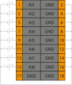

# Модуль аналогового ввода напряжения SA-P5-AIV

## Общие сведения

??? example "Тестирование"

    На текущий момент модуль на стадии тестирования. Серийный выпуск запланирован на декабрь 2025 года 

<div class="grid cards" markdown>

{ width="250" align=left  }
Модуль аналогового ввода напряжения (AIV) (арт. SA-P5-AIV) является 8-ми канальным модулем расширения и предназначен для получения аналоговых сигналов по напряжению от внешних источников напряжения
</div>

## Технические характеристики 
| Характеристика                          | Значение                          |
|-----------------------------------------|-----------------------------------|
| количество канало                       | 8                                 |
| Диапазон измерения напряжения, В        | от - 10 до 10                     |
| Приведенная погрешность измерения, %    | 0,025                             |
| Наличие индикации каждого канала        | да                                |
| Наличие индикации питания, канала информационного обмена| да                |
| Напряжение питания, В                   | от 19 до 29                       |
| Номинальное напряжение питания, В       | 24                                |
| Потребляемая мощность, Вт, не более     | 2,5                               |
| Входное сопротивление, МОм, не менее    | 1                                 |
| Гальваническая изоляция                 | Между входной и выходной логикой  |
| Вес, кг, не более                       | 0,12                              |
| Размеры (Ш х В х Г), мм                 | 21,8х130,9x98,0                   |


## Эксплуатационные характеристики
| Характеристика                   | Значение           |
| -------------------------------- | -                  |
| Температура эксплуатации, °С     | От минус 40 до 60  |
| Температура хранения, °С         | От минус 40 до 60  |
| Влажность при хранении, %	       | От 5 до 95         |
| Влажность при эксплуатации, %    | От 5 до 95         |
| Тип монтажа                      | На DIN-рейку 35 мм |
| Расположение при монтаже         | Вертикальное       |

## Схема подключения

<div class="grid cards" markdown>
{ width="370"; align=left  }

{ width="170";  }
</div>

| Обозначение | Наименование канала | Описание          |
|-------------|---------------------|-------------------|
| 1           | AI1                 | Входной канал 1   |
| 2           | GND                 | Общий контакт     |
| 3           | AI2                 | Входной канал 2   |
| 4           | GND                 | Общий контакт     |
| 5           | AI3                 | Входной канал 3   |
| 6           | GND                 | Общий контакт     |
| 7           | AI4                 | Входной канал 4   |
| 8           | GND                 | Общий контакт     |
| 9           | AI5                 | Входной канал 5   |
| 10          | GND                 | Общий контакт     |
| 11          | AI6                 | Входной канал 6   |
| 12          | GND                 | Общий контакт     |
| 13          | AI7                 | Входной канал 7   |
| 14          | GND                 | Общий контакт     |
| 15          | AI8                 | Входной канал 8   |
| 16          | GND                 | Общий контакт     |
| 17          | GND                 | Общий контакт     |
| 18          | GND                 | Общий контакт     |


## Индикация
| Обозначение | Индикация | Показатель |
|------------------|----------------------|---------------------------------------|
| P | :green_circle:| Наличие напряжения питания |
| P | :white_circle:| Отсутствие напряжения питания |
| L | :green_circle:| Наличие соединения Ethernet |
| L | :yellow_circle: :green_circle: :yellow_circle: | Обмен данными по Ethernet |
| L | :white_circle:| Отсутствие соединения Ethernet|


## Размеры

=== "Габаритные размеры" 
    { width="580"  }
=== "Установочные размеры"
     

## 3D-модель
<model-viewer src="https://manual.saplc.ru//img/3d/DI.glb"
alt="3D Model"
auto-rotate
camera-controls
poster="https://manual.saplc.ru//img/3d/posterDI.webp"
camera-orbit="160deg 75deg 348m"
field-of-view="30deg"
exposure="0.5"
style="width: 100%; height: 500px;">
</model-viewer>

## Программное обеспечение
Обмен данными осуществляется с использованием объектов PDO (Process Data Objects) для оперативной передачи входных данных и SDO (Service Data Objects) для настройки параметров и получения статуса каналов.

## PDO (Process Data Objects)
PDO используются для передачи данных в реальном времени. Модуль предоставляет 8 входных каналов, значения которых передаются через структуру "Inputs". Каждый канал измеряет напряжение в заданном диапазоне, определяемом настройками в SDO.

Структура PDO:
```
|─ Inputs
     |─ Channel 1 (Входной канал 1)
     |─ Channel 2 (Входной канал 2)
     |─ Channel 3 (Входной канал 3)
     |─ Channel 4 (Входной канал 4)
     |─ Channel 5 (Входной канал 5)
     |─ Channel 6 (Входной канал 6)
     |─ Channel 7 (Входной канал 7)
     |─ Channel 8 (Входной канал 8)
```
**Назначение:** Передача измеренных значений напряжения с каждого из 8 каналов.  
**Формат данных:** 32-битное значение с плавающей точкой (float), обеспечивающее высокую точность измерений.
## SDO (Service Data Objects)
SDO используются для конфигурации модуля и диагностики состояния каналов. Структура SDO включает два основных раздела: настройки (Settings) и статус (Status).

Структура SDO:
```
|─ Settings
|     |─ Channel 1
|     |     |─ Input type
|     |     |     |─ Off (Выключено) — значение по умолчанию
|     |     |     |─ Voltage 0 +5V (Напряжение от 0 до +5 В)
|     |     |     |─ Voltage 0 +10V (Напряжение от 0 до +10 В)
|     |     |     |─ Voltage -5 +5V (Напряжение от -5 до +5 В)
|     |     |     |─ Voltage -10 +10V (Напряжение от -10 до +10 В)
|     |     |─ Average samples (Среднее количество выборок)
|     |─ Channel 2 (аналогично)
|     |─ Channel 3 (аналогично)
|     |─ Channel 4 (аналогично)
|     |─ Channel 5 (аналогично)
|     |─ Channel 6 (аналогично)
|     |─ Channel 7 (аналогично)
|     |─ Channel 8 (аналогично)
|
|─ Status
|     |─ Channel 1
|     |     |─ Status (Битовое поле)
|     |─ Channel 2 (аналогично)
|     |─ Channel 3 (аналогично)
|     |─ Channel 4 (аналогично)
|     |─ Channel 5 (аналогично)
|     |─ Channel 6 (аналогично)
|     |─ Channel 7 (аналогично)
|     |─ Channel 8 (аналогично)
Settings (Настройки):
```

**Input type:** Позволяет выбрать тип входного сигнала для каждого канала: Off (Выключено), Voltage 0 +5V, Voltage 0 +10V, Voltage -5 +5V или Voltage -10 +10V. 

???+ info "Примечание"
    При отключении канала скорость опроса других увеличивается
При уменьшении измеряемого диапазона (например, с Voltage -10 +10V до Voltage 0 +5V) увеличивается точность измерений, однако выбранный диапазон должен быть одинаковым для всех каналов модуля.

**Average samples:** Настройка фильтрации методом "Скользящего среднего". Диапазон значений: от 1 (фильтрация выключена) до 255, по умолчанию — 16.

**Status (Состояние):**

Отображает диагностическую информацию о состоянии каналов в виде битового поля:

|Номер бита|Описание|
|-|-|
|0|Отключен|
|1|Перегрузка|
|2|Зарезервирован|
|3|Зарезервирован|
|4|Зарезервирован|
|5|Зарезервирован|
|6|Зарезервирован|
|7|Зарезервирован|


### Принцип работы
**Конфигурация:** Через SDO задается тип входного сигнала (например, Voltage 0 +10V) и ширина окна фильтрации для каждого канала.

**Измерение:** Через PDO в реальном времени передаются измеренные значения напряжения с каждого из 8 каналов в пределах заданного диапазона.

**Диагностика:** Через SDO можно запросить состояние каналов для выявления ошибок (перегрузка, отключение и т.д.).

### Пример конфигурации
Установить Channel 1 в режим "Voltage -10 +10V" и ширину фильтрации 32 выборки через SDO.
Получить значение напряжения с Channel 1 через PDO (например, 7.2 В).
Проверить состояние Channel 1 через SDO (Status), чтобы убедиться в отсутствии перегрузки.


