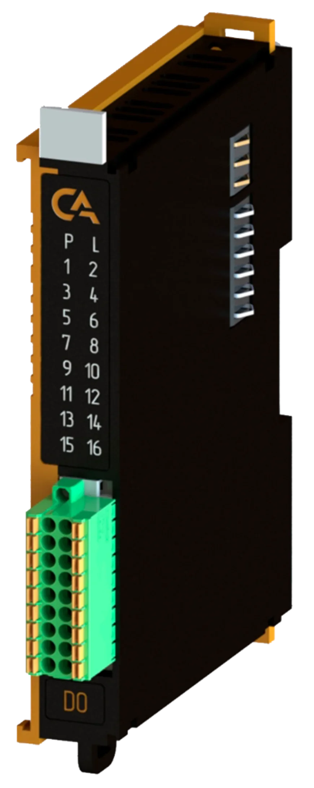
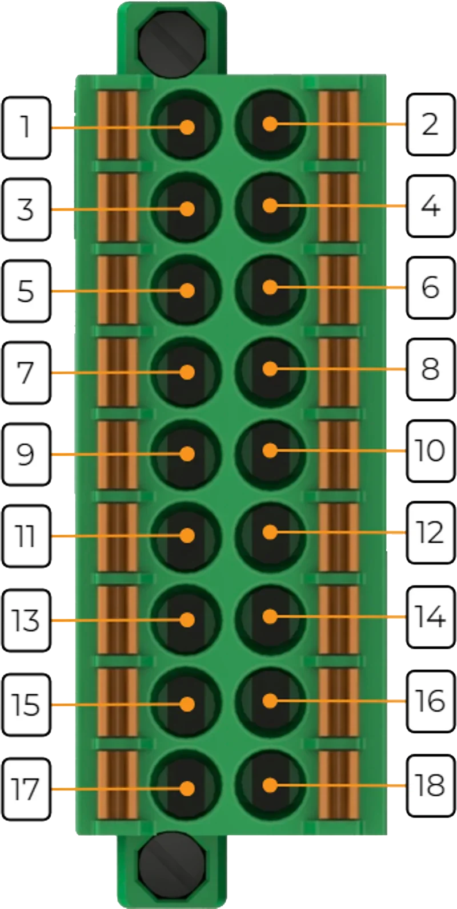

# Модуль аналогового ввода виброскорости PICCO-P5-AIVS

## Общие сведения

??? example "Разработка"

    На текущий момент модуль на стадии разработки. Серийный выпуск запланирован на 2026 год 

{ width="150" align=left  }
Модуль аналогового ввода виброскорости AIVS (арт. PICCO-P5-AIVS) является 4-х канальным модулем расширения и предназначен для получения аналоговых сигналов от датчиков виброскорости типа МВ38

## Технические характеристики 
| Характеристика                          | Значение                          |
|-----------------------------------------|-----------------------------------|
| Максимальная потребляемая мощность, Вт  | Тестируется                       |
| Количество входных каналов              | 4                                 |
| Гальваническая изоляция                 | Между входной и выходной логикой  |
| Сечение проводника, мм²                 | От 0,2 до 1,5                     |
| Масса, г                                | 125                               |
| Габариты ВхШхГ, мм                      | 126х21,3х90                       |

## Эксплуатационные характеристики
| Характеристика                   | Значение           |
| -------------------------------- | -                  |
| Температура эксплуатации, °С     | От минус 40 до 60  |
| Температура хранения, °С         | От минус 40 до 60  |
| Влажность при хранении, %	       | От 5 до 95         |
| Влажность при эксплуатации, %    | От 5 до 95         |
| Тип монтажа                      | На DIN-рейку 35 мм |
| Расположение при монтаже         | Вертикальное       |

## Схема подключения

{ width="370"; align=left  }

{ width="170";  }

| Обозначение | Наименование канала | Описание          |
|-------------|---------------------|-------------------|
| 1           | AI1(P)                | Входной канал 1 (+)|
| 2           | AI1(N)                | Входной канал 1 (-)|
| 3           | AI2(P)                | Входной канал 2 (+)|
| 4           | AI2(N)                | Входной канал 2 (-)|
| 5           | AI3(P)                | Входной канал 3 (+)|
| 6           | AI3(N)                | Входной канал 3 (-)|
| 7           | AI4(P)                | Входной канал 4 (+)|
| 8           | AI4(N)                | Входной канал 4 (-)|
| 9           | GND                 | Общий контакт     |
| 10          | GND                 | Общий контакт     |
| 11          | GND                 | Общий контакт     |
| 12          | GND                 | Общий контакт     |
| 13          | GND                 | Общий контакт     |
| 14          | GND                 | Общий контакт     |
| 15          | GND                 | Общий контакт     |
| 16          | GND                 | Общий контакт     |
| 17          | GND                 | Общий контакт     |
| 18          | GND                 | Общий контакт     |

## Индикация
| Обозначение | Индикация | Показатель |
|------------------|----------------------|---------------------------------------|
| P | :green_circle:| Наличие напряжения питания |
| P | :white_circle:| Отсутствие напряжения питания |
| L | :green_circle:| Наличие соединения Ethernet |
| L | :yellow_circle: :green_circle: :yellow_circle: | Обмен данными по Ethernet |
| L | :white_circle:| Отсутствие соединения Ethernet|

## Размеры

=== "Габаритные размеры" 
    { width="580"  }
=== "Установочные размеры"
     

## 3D-модель
<model-viewer src="https://manual.saplc.ru//img/3d/DI.glb"
alt="3D Model"
auto-rotate
camera-controls
poster="https://manual.saplc.ru//img/3d/posterDI.webp"
camera-orbit="160deg 75deg 348m"
field-of-view="30deg"
exposure="0.5"
style="width: 100%; height: 500px;">
</model-viewer>

