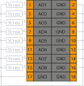

# Модуль аналогового вывода SA-P5-AO

## Общие сведения

??? example "Тестирование"

    На текущий момент модуль на стадии тестирования. Серийный выпуск запланирован на декабрь 2025 года

<div class="grid cards" markdown>

{ width="150" align=left  }
Модуль аналогового вывода (AO) (арт. SA-P5-AO) является 8-ми канальным модулем расширения и предназначен для выдачи аналоговых сигналов на внешние устройства.  
Каждый канал модуля может выдавать постоянное напряжение или постоянный ток.
</div>

## Технические характеристики 

| Характеристика                          | Значение                          |
|-----------------------------------------|-----------------------------------|
| Максимальная потребляемая мощность, Вт  | 7,5                               |
| Количество выходных каналов             | 8                                 |
| Защита от перегрузки                    | Да                                |
| Диапазон выходного тока, мА             | 0 ... 20                          |
| Максимальное нагрузочное сопротивления для тока, Ом | 500                   |
| Диапазон выдаваемого напряжения, В      | - 10 ... 10                       |
| Минимальное нагрузочное сопротивления для напряжения, Ом| 1000              |  
| Погрешность модуля, %                   | ±0.5 от полной шкалы              |
| Время преобразования на все каналы, мс  |	Не более 50                       |
| Разрядность АЦП, бит                    |	16                                |
| Гальваническая изоляция                 | Между входной и выходной логикой  |
| Сечение проводника, мм²                 | От 0,2 до 1,5                     |
| Масса, г                                | 120                               |
| Габариты ВхШхГ, мм                      | 126х21х90                         |

## Эксплуатационные характеристики
| Характеристика                   | Значение           |
| -------------------------------- | -                  |
| Температура эксплуатации, °С     | От минус 40 до 60  |
| Температура хранения, °С         | От минус 40 до 60  |
| Влажность при хранении, %	       | От 5 до 95         |
| Влажность при эксплуатации, %    | От 5 до 95         |
| Тип монтажа                      | На DIN-рейку 35 мм |
| Расположение при монтаже         | Вертикальное       |

## Схема подключения

<div class="grid cards" markdown>
{ width="370"; align=left  }

{ width="170";  }
</div>


| Обозначение | Наименование канала | Описание          |
|-------------|---------------------|-------------------|
| 1           | AO1                 | Выходной канал 1  |
| 2           | GND                 | Общий контакт     |
| 3           | AO2                 | Выходной канал 2  |
| 4           | GND                 | Общий контакт     |
| 5           | AO3                 | Выходной канал 3  |
| 6           | GND                 | Общий контакт     |
| 7           | AO4                 | Выходной канал 4  |
| 8           | GND                 | Общий контакт     |
| 9           | AO5                 | Выходной канал 5  |
| 10          | GND                 | Общий контакт     |
| 11          | AO6                 | Выходной канал 6  |
| 12          | GND                 | Общий контакт     |
| 13          | AO7                 | Выходной канал 7  |
| 14          | GND                 | Общий контакт     |
| 15          | AO8                 | Выходной канал 8  |
| 16          | GND                 | Общий контакт     |
| 17          | GND                 | Общий контакт     |
| 18          | GND                 | Общий контакт     |

## Индикация
| Обозначение | Индикация | Показатель |
|------------------|----------------------|---------------------------------------|
| P | :green_circle:| Наличие напряжения питания |
| P | :white_circle:| Отсутствие напряжения питания |
| L | :green_circle:| Наличие соединения Ethernet |
| L | :yellow_circle: :green_circle: :yellow_circle: | Обмен данными по Ethernet |
| L | :white_circle:| Отсутствие соединения Ethernet|

## Размеры

=== "Габаритные размеры" 
    { width="580"}
=== "Установочные размеры"
     

## 3D-модель
<model-viewer src="https://manual.saplc.ru//img/3d/DI.glb"
alt="3D Model"
auto-rotate
camera-controls
poster="https://manual.saplc.ru//img/3d/posterDI.webp"
camera-orbit="160deg 75deg 348m"
field-of-view="30deg"
exposure="0.5"
style="width: 100%; height: 500px;">
</model-viewer>


## Программное обеспечение

Обмен данными осуществляется с использованием объектов PDO (Process Data Objects) для оперативного управления выходными каналами и SDO (Service Data Objects) для настройки параметров и получения статуса.

### PDO (Process Data Objects)
PDO используются для передачи данных в реальном времени. Модуль предоставляет 8 выходных каналов, значения которых задаются через структуру Outputs. Каждый канал может быть настроен на выдачу напряжения или тока в зависимости от конфигурации в SDO.

Структура PDO:

```  
|─ Outputs
     |─ Channel 1 (Выходной канал 1)
     |─ Channel 2 (Выходной канал 2)
     |─ Channel 3 (Выходной канал 3)
     |─ Channel 4 (Выходной канал 4)
     |─ Channel 5 (Выходной канал 5)
     |─ Channel 6 (Выходной канал 6)
     |─ Channel 7 (Выходной канал 7)
     |─ Channel 8 (Выходной канал 8)
```

* **Назначение:** Передача значений аналоговых сигналов (напряжение или ток) на каждый из 8 каналов  
* **Формат данных:** 16-битное значение с плавающей точкой 
### SDO (Service Data Objects)
SDO используются для конфигурации модуля и диагностики состояния каналов. Структура SDO включает два основных раздела: настройки (Settings) и статус (Status).

Структура SDO:


```  
Копировать
|─ Settings
|     |─ Channel 1
|     |     |─ Output type
|     |     |     |─ Off (Выключено)- значение по умолчанию
|     |     |     |─ Voltage 0 +5V (Напряжение от 0 до +5 В)
|     |     |     |─ Voltage 0 +10V (Напряжение от 0 до +10 В)
|     |     |     |─ Voltage -5 +5V (Напряжение от -5 до +5 В)
|     |     |     |─ Voltage -10 +10V (Напряжение от -10 до +10 В)
|     |     |     |─ Current 4-20mA (Ток от 4 до 20 мА)
|     |     |     |─ Current 0-20mA (Ток от 0 до 20 мА)
|     |     |     |─ Current 0-24mA (Ток от 4 до 24 мА)
|     |─ Channel 2 (аналогично)
|     |─ Channel 3 (аналогично)
|     |─ Channel 4 (аналогично)
|     |─ Channel 5 (аналогично)
|     |─ Channel 6 (аналогично)
|     |─ Channel 7 (аналогично)
|     |─ Channel 8 (аналогично)
|
|─ Status
|     |─ Channel 1
|     |     |─ Fault (Битовое поле. Подробнее ниже)
|     |─ Channel 2 (аналогично)
|     |─ Channel 3 (аналогично)
|     |─ Channel 4 (аналогично)
|     |─ Channel 5 (аналогично)
|     |─ Channel 6 (аналогично)
|     |─ Channel 7 (аналогично)
|     |─ Channel 8 (аналогично)
```  

**Settings (Настройки):** - Позволяет выбрать тип выходного сигнала для каждого канала: выключено, стабилизация по напряжению или стабилизация по току.  
Конфигурация применяется к соответствующему каналу в PDO.  
**Status (Состояние):** - Отображает диагностическую информацию о состоянии каналов.
Параметр Fault каждого канало сигнализирует о наличии неисправности 

|Номер бита|Описание|
|-|-|
|0|проблема цепи (обрыв цепи для режима стабилизации по току, короткое замыкание для режима стабилизации по напряжению)|
|1||Заданное значение вне диапазона|
|2|Перегрев модуля|
|3|Зарезервирован|
|4|Зарезервирован|
|5|Зарезервирован|
|6|Зарезервирован|
|7|Зарезервирован|


### Принцип работы
Конфигурация: Через SDO задается тип выходного сигнала для каждого канала 
Управление: Через PDO в реальном времени передаются значения сигналов для каждого канала в пределах заданного диапазона 
Диагностика: Через SDO можно запросить состояние каналов для выявления ошибок.
Пример конфигурации
Установить Channel 1 в режим "Voltage -10 +10V" через SDO.
Задать значение +5 В через PDO для Channel 1.
Проверить состояние Fault для Channel 1 через SDO, чтобы убедиться в отсутствии ошибок.

## Файлы для скачивания
<a href="/downloads/IPCSA_OG.xml" download>XML конфигурационный файл для TwinCAT</a>    
<a href="/downloads/Module_18_pin.step" download>3D-модель</a>   
<a href="/downloads/Module_18_pin.dwg" download>2D-модель</a>    


