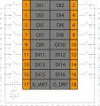
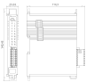
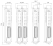

# Модуль дискретного ввода SA-P5-DI 

## Общие сведения

??? example "Тестирование"

    На текущий момент модуль на стадии тестирования. Серийный выпуск запланирован на декабрь 2025 года 

<div style="display: flex; gap: 2rem; align-items: flex-start; margin: 1rem 0;">
    

    <div style="flex: 1; text-align: justify;">
        <p style="text-align: justify; margin: 0 0 1rem 0;"><strong>Наименование:</strong> Модуль дискретного ввода DI</p>
        
        <p style="text-align: justify; margin: 0 0 1rem 0;"><strong>Исполнения:</strong><br>
        - SA-P5-DI (без покрытия)<br>
        - SA-P5-DI-V (с лаковым покрытием)</p>
        
        <p style="text-align: justify; margin: 0 0 1rem 0;"><strong>Назначение:</strong><br>
        Модуль дискретного ввода DI (далее-модуль) предназначен для приема и обработки дискретных команд по каждому каналу и выдачи обработанных параметров в цифровом виде по каналу связи.</p>
        
        <p style="text-align: justify; margin: 0 0 1rem 0;">В модуле предусмотрено две схемы подключения: «сухим» (dry) и «мокрым» (wet) контактом.</p>
        
        <p style="text-align: justify; margin: 0 0 1rem 0;">При подключении «мокрым» контактом модуль принимает дискретные команды от внешнего источника питания, при этом допускается подача напряжения как положительной, так и отрицательной полярности.</p>
        
        <p style="text-align: justify; margin: 0 0 1rem 0;">При подключении «сухим» контактом не требуется подача внешнего напряжения.</p>
    </div>
</div>


## Технические характеристики
<div style="margin-bottom: -1rem;">
<table style="border-collapse: collapse; width: 100%; min-width: 100%; table-layout: fixed;">
  <colgroup>
    <col style="width: 600px;">   <!-- Фиксированная ширина -->
    <col style="width: 400px;">   <!-- Фиксированная ширина -->
  </colgroup>
  <thead>
    <tr>
      <th style="text-align: center; padding: 8px; border: 1px solid #ccc; word-wrap: break-word;">Характеристика</th>
      <th style="text-align: center; padding: 8px; border: 1px solid #ccc; word-wrap: break-word;">Значение</th>
    </tr>
  </thead>
  <tbody>
    <tr>
      <td style="padding: 8px; border: 1px solid #ccc; word-wrap: break-word;">Количество каналов</td>
      <td style="padding: 8px; border: 1px solid #ccc; word-wrap: break-word;">16</td>
    </tr>
    <tr>
      <td style="padding: 8px; border: 1px solid #ccc; word-wrap: break-word;">Диапазон детектирования логической единицы при<br>подключении «мокрым» контактом, В</td>
      <td style="padding: 8px; border: 1px solid #ccc; word-wrap: break-word;">от минус 30 до минус 10<br>и от 10 до 30</td>
    </tr>
    <tr>
      <td style="padding: 8px; border: 1px solid #ccc; word-wrap: break-word;">Диапазон детектирования логического нуля при<br>подключении «мокрым» контактом, В</td>
      <td style="padding: 8px; border: 1px solid #ccc; word-wrap: break-word; vertical-align: middle;">от минус 3 до 3</td>
    </tr>
    <tr>
      <td style="padding: 8px; border: 1px solid #ccc; word-wrap: break-word;">Детектирование логической единицы «сухим» контактом</td>
      <td style="padding: 8px; border: 1px solid #ccc; word-wrap: break-word;">при замыкании цепи</td>
    </tr>
    <tr>
      <td style="padding: 8px; border: 1px solid #ccc; word-wrap: break-word;">Детектирование логического нуля «сухим» контактом</td>
      <td style="padding: 8px; border: 1px solid #ccc; word-wrap: break-word;">при размыкании цепи</td>
    </tr>
    <tr>
      <td style="padding: 8px; border: 1px solid #ccc; word-wrap: break-word;">Наличие индикации каждого канала</td>
      <td style="padding: 8px; border: 1px solid #ccc; word-wrap: break-word;">да</td>
    </tr>
    <tr>
      <td style="padding: 8px; border: 1px solid #ccc; word-wrap: break-word;">Наличие индикации питания, канала информационного обмена</td>
      <td style="padding: 8px; border: 1px solid #ccc; word-wrap: break-word;">да</td>
    </tr>
    <tr>
      <td style="padding: 8px; border: 1px solid #ccc; word-wrap: break-word;">Напряжение питания, В</td>
      <td style="padding: 8px; border: 1px solid #ccc; word-wrap: break-word;">от 19 до 29</td>
    </tr>
    <tr>
      <td style="padding: 8px; border: 1px solid #ccc; word-wrap: break-word;">Номинальное напряжение питания, В</td>
      <td style="padding: 8px; border: 1px solid #ccc; word-wrap: break-word;">24</td>
    </tr>
    <tr>
      <td style="padding: 8px; border: 1px solid #ccc; word-wrap: break-word;">Потребляемая мощность, Вт, не более</td>
      <td style="padding: 8px; border: 1px solid #ccc; word-wrap: break-word;">5</td>
    </tr>
    <tr>
      <td style="padding: 8px; border: 1px solid #ccc; word-wrap: break-word;">Гальваническая изоляция</td>
      <td style="padding: 8px; border: 1px solid #ccc; word-wrap: break-word;">Между входной и выходной логикой</td>
    </tr>
    <tr>
      <td style="padding: 8px; border: 1px solid #ccc; word-wrap: break-word;">Вес, кг, не более</td>
      <td style="padding: 8px; border: 1px solid #ccc; word-wrap: break-word;">0,12</td>
    </tr>
    <tr>
      <td style="padding: 8px; border: 1px solid #ccc; word-wrap: break-word;">Размеры (Ш х В х Г), мм</td>
      <td style="padding: 8px; border: 1px solid #ccc; word-wrap: break-word;">21,8х130,9x98,0</td>
    </tr>
  </tbody>
</table>
</div>

## Эксплуатационные характеристики
<div style="width: 100%; display: grid; grid-template-columns: 1fr; margin-bottom: -1rem;">
  <table style="border-collapse: collapse; width: 100%; min-width: 100%; table-layout: fixed; grid-column: 1 / -1;">
    <colgroup>
      <col style="width: 500px;">   <!-- Параметр -->
      <col style="width: 250px;">   <!-- Без лака -->
      <col style="width: 250px;">   <!-- С лаком -->
    </colgroup>
    <thead>
      <tr>
        <th rowspan="2" style="text-align: center; vertical-align: middle; padding: 8px; border: 1px solid #ccc;">Параметр</th>
        <th colspan="2" style="text-align: center; vertical-align: middle; padding: 8px; border: 1px solid #ccc;">Значение фактора</th>
      </tr>
      <tr>
        <th style="text-align: center; padding: 8px; border: 1px solid #ccc;">Без лака</th>
        <th style="text-align: center; padding: 8px; border: 1px solid #ccc;">С лаком</th>
      </tr>
    </thead>
    <tbody>
      <tr>
        <td style="padding: 8px; border: 1px solid #ccc;"><strong>Температура среды, °С</strong></td>
        <td colspan="2" style="text-align: center; vertical-align: middle; padding: 8px; border: 1px solid #ccc;">от минус 40 до 60</td>
      </tr>
      <tr>
        <td style="padding: 8px; border: 1px solid #ccc;"><strong>Относительная влажность воздуха, %</strong></td>
        <td style="text-align: center; vertical-align: middle; padding: 8px; border: 1px solid #ccc;">от 5 до 70</td>
        <td style="text-align: center; vertical-align: middle; padding: 8px; border: 1px solid #ccc;">от 5 до 95</td>
      </tr>
      <tr>
        <td style="padding: 8px; border: 1px solid #ccc;"><strong>Атмосферное давление, кПа</strong></td>
        <td colspan="2" style="text-align: center; vertical-align: middle; padding: 8px; border: 1px solid #ccc;">от 84,0 до 106,7</td>
      </tr>
      <tr>
        <td style="padding: 8px; border: 1px solid #ccc;"><strong>Вибрация</strong><br><em>амплитуда, не более</em></td>
        <td colspan="2" style="text-align: center; vertical-align: middle; padding: 8px; border: 1px solid #ccc;">0,35 мм с частотой 55 Гц</td>
      </tr>
    </tbody>
  </table>
</div>

## Схема подключения

<div class="grid cards" markdown>
{ width="370"; align=left  }

{ width="170";  }
</div>

Контакты «GND_DRY» и «GND_WET» предназначены для подключения входов по принципу «сухого» или «мокрого» контакта соответственно.


<div style="margin-bottom: -1rem;">
<table style="border-collapse: collapse; width: 100%; min-width: 100%; table-layout: fixed;">
  <colgroup>
    <col style="width: 200px;">   
    <col style="width: 200px;">
    <col style="width: 600px;">   
  </colgroup>
  <thead>
    <tr>
      <th style="text-align: center; padding: 8px; border: 1px solid #ccc; word-wrap: break-word;">Обозначение</th>
      <th style="text-align: center; padding: 8px; border: 1px solid #ccc; word-wrap: break-word;">Название канала</th>
      <th style="text-align: center; padding: 8px; border: 1px solid #ccc; word-wrap: break-word;">Описание</th>
    </tr>
  </thead>
  <tbody>
    <tr>
      <td style="padding: 8px; border: 1px solid #ccc; word-wrap: break-word; text-align: center; vertical-align: middle;">1 - 16</td>
      <td style="padding: 8px; border: 1px solid #ccc; word-wrap: break-word; text-align: center; vertical-align: middle;">DO1 - DO16</td>
      <td style="padding: 8px; border: 1px solid #ccc; word-wrap: break-word; vertical-align: middle;">Входной канал 1 - 16</td>
    </tr>
    <tr>
      <td style="padding: 8px; border: 1px solid #ccc; word-wrap: break-word; text-align: center; vertical-align: middle;">17</td>
      <td style="padding: 8px; border: 1px solid #ccc; word-wrap: break-word; text-align: center; vertical-align: middle;">G_WET</td>
      <td style="padding: 8px; border: 1px solid #ccc; word-wrap: break-word; vertical-align: middle;">Общий контакт при подключении по схеме "мокрый контакт"</td>
    </tr>
    <tr>
      <td style="padding: 8px; border: 1px solid #ccc; word-wrap: break-word; text-align: center; vertical-align: middle;">18</td>
      <td style="padding: 8px; border: 1px solid #ccc; word-wrap: break-word; text-align: center; vertical-align: middle;">G_DRY</td>
      <td style="padding: 8px; border: 1px solid #ccc; word-wrap: break-word; vertical-align: middle;">Общий контакт при подключении по схеме "сухой контакт"</td>
    </tr>
  </tbody>
</table>
</div>

## Индикация
<div style="width: 100%; display: grid; grid-template-columns: 1fr; margin-bottom: -1rem;">
  <table style="border-collapse: collapse; width: 100%; min-width: 100%; table-layout: fixed; grid-column: 1 / -1;">
    <colgroup>
      <col style="width: 200px;">   <!-- Параметр -->
      <col style="width: 200px;">   <!-- Без лака -->
      <col style="width: 600px;">   <!-- С лаком -->
    </colgroup>
      <thead>
        <tr>
          <th style="text-align: center; padding: 8px; border: 1px solid #ccc;">Обозначение</th>
          <th style="text-align: center; padding: 8px; border: 1px solid #ccc;">Индикация</th>
          <th style="text-align: center; padding: 8px; border: 1px solid #ccc;">Показатель</th>
        </tr>
      </thead>
      <tbody>
        <tr>
          <td style="text-align: center; padding: 8px; border: 1px solid #ccc;">P</td>
          <td style="text-align: center; padding: 8px; border: 1px solid #ccc;"><span class="status-dot green"></span></td>
          <td style="padding: 8px; border: 1px solid #ccc;">Наличие напряжения питания</td>
        </tr>
        <tr>
          <td style="text-align: center; padding: 8px; border: 1px solid #ccc;">P</td>
          <td style="text-align: center; padding: 8px; border: 1px solid #ccc;"><span class="status-dot off"></span></td>
          <td style="padding: 8px; border: 1px solid #ccc;">Отсутствие напряжения питания</td>
        </tr>
        <tr>
          <td style="text-align: center; padding: 8px; border: 1px solid #ccc;">L</td>
          <td style="text-align: center; padding: 8px; border: 1px solid #ccc;"><span class="status-dot green"></span></td>
          <td style="padding: 8px; border: 1px solid #ccc;">Наличие соединения по Ethernet</td>
        </tr>
        <tr>
          <td style="text-align: center; padding: 8px; border: 1px solid #ccc;">L</td>
          <td style="text-align: center; padding: 8px; border: 1px solid #ccc;"><span class="status-dot ethernet-pulse"></span></td>
          <td style="padding: 8px; border: 1px solid #ccc;">Обмен данными по Ethernet</td>
        </tr>
        <tr>
          <td style="text-align: center; padding: 8px; border: 1px solid #ccc;">L</td>
          <td style="text-align: center; padding: 8px; border: 1px solid #ccc;"><span class="status-dot off"></span></td>
          <td style="padding: 8px; border: 1px solid #ccc;">Отсутствие соединения по Ethernet</td>
        </tr>
        <tr>
          <td style="text-align: center; padding: 8px; border: 1px solid #ccc;">L</td>
          <td style="text-align: center; padding: 8px; border: 1px solid #ccc;"><span class="status-dot orange"></span></td>
          <td style="padding: 8px; border: 1px solid #ccc;">Модуль в рабочем состоянии</td>
        </tr>
        <tr>
          <td style="text-align: center; padding: 8px; border: 1px solid #ccc;">L</td>
          <td style="text-align: center; padding: 8px; border: 1px solid #ccc;"><span class="status-dot orange-pulse"></span></td>
          <td style="padding: 8px; border: 1px solid #ccc;">Выполнение загрузки</td>
        </tr>
        <tr>
          <td style="text-align: center; padding: 8px; border: 1px solid #ccc;">1 - 16</td>
          <td style="text-align: center; padding: 8px; border: 1px solid #ccc;"><span class="status-dot green"></span></td>
          <td style="padding: 8px; border: 1px solid #ccc;">Пользовательский светодиод 1 - 16 включен</td>
        </tr>
        <tr>
          <td style="text-align: center; padding: 8px; border: 1px solid #ccc;">1 - 16</td>
          <td style="text-align: center; padding: 8px; border: 1px solid #ccc;"><span class="status-dot off"></span></td>
          <td style="padding: 8px; border: 1px solid #ccc;">Пользовательский светодиод 1 - 16 выключен</td>
        </tr>
      </tbody>
  </table>
</div>

<style>
.status-dot {
    display: inline-block;
    width: 10px;
    height: 10px;
    border-radius: 50%;
    margin-right: 2px;
}

.status-dot.green { background-color: #0ec20eff; }
.status-dot.orange { background-color: #ffa500; }
.status-dot.off { background-color: #cccccc; }

.status-dot.ethernet-pulse {
    background-color: #0ec20eff;
    animation: soft-pulse 1.5s ease-in-out infinite;
    box-shadow: 0 0 10px rgba(0, 255, 0, 0.5);
}

.status-dot.orange-pulse {
    background-color: #ffa500;
    animation: soft-pulse-orange 1.5s ease-in-out infinite;
    box-shadow: 0 0 10px rgba(255, 165, 0, 0.5);
}

@keyframes soft-pulse {
    0%, 100% { opacity: 0.4; transform: scale(0.9); box-shadow: 0 0 5px rgba(0, 255, 0, 0.3); }
    50% { opacity: 1; transform: scale(1.1); box-shadow: 0 0 15px rgba(0, 255, 0, 0.7); }
}

@keyframes soft-pulse-orange {
    0%, 100% { opacity: 0.4; transform: scale(0.9); box-shadow: 0 0 5px rgba(255, 165, 0, 0.3); }
    50% { opacity: 1; transform: scale(1.1); box-shadow: 0 0 15px rgba(255, 165, 0, 0.7); }
}
</style>

## Размеры

=== "Габаритные размеры" 
    {width="580"}
=== "Установочные размеры"
     

## 3D-модель
<model-viewer src="https://manual.saplc.ru//img/3d/DI.glb"
alt="3D Model"
auto-rotate
camera-controls
poster="https://manual.saplc.ru//img/3d/posterDI.webp"
camera-orbit="160deg 75deg 348m"
field-of-view="30deg"
exposure="0.5"
style="width: 100%; height: 500px;">
</model-viewer>


## Программное обеспечение
Обмен данными осуществляется с использованием объектов PDO (Process Data Objects) для оперативного управления выходами модуля.

## PDO (Process Data Objects)
PDO используются для передачи данных в реальном времени. Модуль предоставляет два набора входных данных, передаваемых через структуры TxPDO "Byte_Lo" и TxPDO "Byte_Hi". Каждый бит в двух 8-битных значениях соответствует состоянию одного из 16 каналов 
Структура PDO:  
```
|─ Input
     |─ Channel 1 (Канал 1, бит 0)
     |─ Channel 2 (Канал 2, бит 1)
     |─ Channel 3 (Канал 3, бит 2)
     |─ Channel 4 (Канал 4, бит 3)
     |─ Channel 5 (Канал 5, бит 4)
     |─ Channel 6 (Канал 6, бит 5)
     |─ Channel 7 (Канал 7, бит 6)
     |─ Channel 8 (Канал 8, бит 7)
     |─ Channel 9 (Канал 9, бит 0)
     |─ Channel 10 (Канал 10, бит 1)
     |─ Channel 11 (Канал 11, бит 2)
     |─ Channel 12 (Канал 12, бит 3)
     |─ Channel 13 (Канал 13, бит 4)
     |─ Channel 14 (Канал 14, бит 5)
     |─ Channel 15 (Канал 15, бит 6)
     |─ Channel 16 (Канал 16, бит 7)
```
**Назначение:** Передача состояния 16 входных каналов модуля DI, где каждый бит в двух байтах отражает состояние соответствующего канала (0 — выключен, 1 — включен).  
**Формат данных:** Два 8-битных целых числа (bytes), где первый байт (TxPDO 0x1a00 "Byte_Lo", PDO entry 0x6000:01) передает состояние каналов 1–8, а второй байт (TxPDO 0x1a08 "Byte_Hi", PDO entry 0x6080:01) — каналов 9–16.  
### Принцип работы
**Управление:** Через два TxPDO в реальном времени передаются два 8-битных значения, которые отражают состояние всех 16 каналов модуля. Например, значение 0x01 в TxPDO 0x1a00 указывает, что Channel 1 активен, а значение 0x02 в TxPDO 0x1a08 — что Channel 10 активен

### Пример конфигурации
Получить через TxPDO 0x1a00 значение 0x05 (00000101 в двоичной системе), что означает активность Channel 1 и Channel 3, и через TxPDO 0x1a08 значение 0x0A (00001010 в двоичной системе), что означает активность Channel 10 и Channel 12  

Результат: Каналы 1, 3, 10 и 12 активны (включены), остальные — выключены


## Файлы для скачивания
<a href="/downloads/IPCSA_OG.xml" download>XML конфигурационный файл для TwinCAT</a>  
<a href="/downloads/DI.c" download>Cstruct конфигурационный файл для IgH EtherCAT Master</a>     
<a href="/downloads/Module_18_pin.step" download>3D-модель</a>   
<a href="/downloads/Module_18_pin.dwg" download>2D-модель</a>    