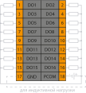

# Модуль дискретного вывода PICCO-P5-DO

## Общие сведения

    

    

        
<strong>Наименование:</strong> Модуль дискретного вывода DO

        
        
<strong>Исполнения:</strong> 
        - PICCO-P5-DO (без покрытия) 
        - PICCO-P5-DO-V (с лаковым покрытием)

        
        
<strong>Назначение:</strong> 
        Модуль дискретного вывода DO (далее — модуль) предназначен для получения обработанных параметров и обеспечения вывода дискретных команд по каждому каналу связи в цифровом виде.

        
        
Вывод осуществляется методом «сухого» контакта.

        
        
Модуль оснащен отдельной клеммой, обеспечивающей защиту от воздействия ЭДС самоиндукции при подключении к нему индуктивной нагрузки (электромагнитные реле и т.п.).

    
    

## Технические характеристики 

<table style="border-collapse: collapse; width: 100%; min-width: 100%; table-layout: fixed;">
  <colgroup>
    <col style="width: 600px;">   <!-- Фиксированная ширина -->
    <col style="width: 400px;">   <!-- Фиксированная ширина -->
  </colgroup>
  <thead>
    <tr>
      <th style="text-align: center; padding: 8px; border: 1px solid #ccc; word-wrap: break-word;">Характеристика</th>
      <th style="text-align: center; padding: 8px; border: 1px solid #ccc; word-wrap: break-word;">Значение</th>
    </tr>
  </thead>
  <tbody>
    <tr>
      <td style="padding: 8px; border: 1px solid #ccc; word-wrap: break-word;">Количество каналов</td>
      <td style="padding: 8px; border: 1px solid #ccc; word-wrap: break-word;">16</td>
    </tr>
    <tr>
      <td style="padding: 8px; border: 1px solid #ccc; word-wrap: break-word;">Диапазон коммутируемого напряжения методом
«сухого» контакта, В</td>
      <td style="padding: 8px; border: 1px solid #ccc; word-wrap: break-word;">от 1 до 30</td>
    </tr>
    <tr>
      <td style="padding: 8px; border: 1px solid #ccc; word-wrap: break-word;">Максимальный коммутируемый ток на канал, А</td>
      <td style="padding: 8px; border: 1px solid #ccc; word-wrap: break-word; vertical-align: middle;">0,3</td>
    </tr>
    <tr>
      <td style="padding: 8px; border: 1px solid #ccc; word-wrap: break-word;">Ток логического нуля (утечки), мкА</td>
      <td style="padding: 8px; border: 1px solid #ccc; word-wrap: break-word;">25</td>
    </tr>
    <tr>
      <td style="padding: 8px; border: 1px solid #ccc; word-wrap: break-word;">Наличие индикации каждого канала</td>
      <td style="padding: 8px; border: 1px solid #ccc; word-wrap: break-word;">да</td>
    </tr>
    <tr>
      <td style="padding: 8px; border: 1px solid #ccc; word-wrap: break-word;">Наличие индикации питания, канала информационного обмена</td>
      <td style="padding: 8px; border: 1px solid #ccc; word-wrap: break-word;">да</td>
    </tr>
    <tr>
      <td style="padding: 8px; border: 1px solid #ccc; word-wrap: break-word;">Напряжение питания, В</td>
      <td style="padding: 8px; border: 1px solid #ccc; word-wrap: break-word;">от 19 до 29</td>
    </tr>
    <tr>
      <td style="padding: 8px; border: 1px solid #ccc; word-wrap: break-word;">Номинальное напряжение питания, В</td>
      <td style="padding: 8px; border: 1px solid #ccc; word-wrap: break-word;">24</td>
    </tr>
    <tr>
      <td style="padding: 8px; border: 1px solid #ccc; word-wrap: break-word;">Потребляемая мощность, Вт, не более</td>
      <td style="padding: 8px; border: 1px solid #ccc; word-wrap: break-word;">3</td>
    </tr>
    <tr>
      <td style="padding: 8px; border: 1px solid #ccc; word-wrap: break-word;">Гальваническая изоляция</td>
      <td style="padding: 8px; border: 1px solid #ccc; word-wrap: break-word;">Между входной и выходной логикой</td>
    </tr>
    <tr>
      <td style="padding: 8px; border: 1px solid #ccc; word-wrap: break-word;">Вес, кг, не более</td>
      <td style="padding: 8px; border: 1px solid #ccc; word-wrap: break-word;">0,12</td>
    </tr>
    <tr>
      <td style="padding: 8px; border: 1px solid #ccc; word-wrap: break-word;">Размеры (Ш х В х Г), мм</td>
      <td style="padding: 8px; border: 1px solid #ccc; word-wrap: break-word;">21,8х130,9x98,0</td>
    </tr>
  </tbody>
</table>

## Эксплуатационные характеристики

  <table style="border-collapse: collapse; width: 100%; min-width: 100%; table-layout: fixed; grid-column: 1 / -1;">
    <colgroup>
      <col style="width: 500px;">   <!-- Параметр -->
      <col style="width: 250px;">   <!-- Без лака -->
      <col style="width: 250px;">   <!-- С лаком -->
    </colgroup>
    <thead>
      <tr>
        <th rowspan="2" style="text-align: center; vertical-align: middle; padding: 8px; border: 1px solid #ccc;">Параметр</th>
        <th colspan="2" style="text-align: center; vertical-align: middle; padding: 8px; border: 1px solid #ccc;">Значение фактора</th>
      </tr>
      <tr>
        <th style="text-align: center; padding: 8px; border: 1px solid #ccc;">Без лака</th>
        <th style="text-align: center; padding: 8px; border: 1px solid #ccc;">С лаком</th>
      </tr>
    </thead>
    <tbody>
      <tr>
        <td style="padding: 8px; border: 1px solid #ccc;">Температура среды, °С</td>
        <td colspan="2" style="text-align: center; vertical-align: middle; padding: 8px; border: 1px solid #ccc;">от минус 40 до 60</td>
      </tr>
      <tr>
        <td style="padding: 8px; border: 1px solid #ccc;">Относительная влажность воздуха, %</td>
        <td style="text-align: center; vertical-align: middle; padding: 8px; border: 1px solid #ccc;">от 5 до 70</td>
        <td style="text-align: center; vertical-align: middle; padding: 8px; border: 1px solid #ccc;">от 5 до 95</td>
      </tr>
      <tr>
        <td style="padding: 8px; border: 1px solid #ccc;">Атмосферное давление, кПа</td>
        <td colspan="2" style="text-align: center; vertical-align: middle; padding: 8px; border: 1px solid #ccc;">от 84,0 до 106,7</td>
      </tr>
      <tr>
        <td style="padding: 8px; border: 1px solid #ccc;">Вибрация <em>амплитуда, не более</em></td>
        <td colspan="2" style="text-align: center; vertical-align: middle; padding: 8px; border: 1px solid #ccc;">0,35 мм с частотой 55 Гц</td>
      </tr>
    </tbody>
  </table>

## Схема подключения

{ width="370"; align=left  }

{ width="170";align=left   }

<table style="border-collapse: collapse; width: 100%; min-width: 100%; table-layout: fixed;">
  <colgroup>
    <col style="width: 250px;">   
    <col style="width: 250px;">
    <col style="width: 600px;">   
  </colgroup>
  <thead>
    <tr>
      <th style="text-align: center; padding: 8px; border: 1px solid #ccc; word-wrap: break-word;">Обозначение</th>
      <th style="text-align: center; padding: 8px; border: 1px solid #ccc; word-wrap: break-word;">Название канала</th>
      <th style="text-align: center; padding: 8px; border: 1px solid #ccc; word-wrap: break-word;">Описание</th>
    </tr>
  </thead>
  <tbody>
    <tr>
      <td style="padding: 8px; border: 1px solid #ccc; word-wrap: break-word; text-align: center; vertical-align: middle;">1 - 16</td>
      <td style="padding: 8px; border: 1px solid #ccc; word-wrap: break-word; text-align: center; vertical-align: middle;">DO1 - DO16</td>
      <td style="padding: 8px; border: 1px solid #ccc; word-wrap: break-word; vertical-align: middle;">Выходной канал 1 - 16</td>
    </tr>
    <tr>
      <td style="padding: 8px; border: 1px solid #ccc; word-wrap: break-word; text-align: center; vertical-align: middle;">17</td>
      <td style="padding: 8px; border: 1px solid #ccc; word-wrap: break-word; text-align: center; vertical-align: middle;">GND</td>
      <td style="padding: 8px; border: 1px solid #ccc; word-wrap: break-word; vertical-align: middle;">Общий контакт</td>
    </tr>
    <tr>
      <td style="padding: 8px; border: 1px solid #ccc; word-wrap: break-word; text-align: center; vertical-align: middle;">18</td>
      <td style="padding: 8px; border: 1px solid #ccc; word-wrap: break-word; text-align: center; vertical-align: middle;">PCOM</td>
      <td style="padding: 8px; border: 1px solid #ccc; word-wrap: break-word; vertical-align: middle;">Защита от индуктивной нагрузки</td>
    </tr>
  </tbody>
</table>

## Индикация

  <table style="border-collapse: collapse; width: 100%; min-width: 100%; table-layout: fixed; grid-column: 1 / -1;">
    <colgroup>
      <col style="width: 250px;">   <!-- Параметр -->
      <col style="width: 250px;">   <!-- Без лака -->
      <col style="width: 600px;">   <!-- С лаком -->
    </colgroup>
      <thead>
        <tr>
          <th style="text-align: center; padding: 8px; border: 1px solid #ccc;">Обозначение</th>
          <th style="text-align: center; padding: 8px; border: 1px solid #ccc;">Индикация</th>
          <th style="text-align: center; padding: 8px; border: 1px solid #ccc;">Показатель</th>
        </tr>
      </thead>
      <tbody>
        <tr>
          <td style="text-align: center; padding: 8px; border: 1px solid #ccc;">P</td>
          <td style="text-align: center; padding: 8px; border: 1px solid #ccc;"></td>
          <td style="padding: 8px; border: 1px solid #ccc;">Наличие напряжения питания</td>
        </tr>
        <tr>
          <td style="text-align: center; padding: 8px; border: 1px solid #ccc;">P</td>
          <td style="text-align: center; padding: 8px; border: 1px solid #ccc;"></td>
          <td style="padding: 8px; border: 1px solid #ccc;">Отсутствие напряжения питания</td>
        </tr>
        <tr>
          <td style="text-align: center; padding: 8px; border: 1px solid #ccc;">L</td>
          <td style="text-align: center; padding: 8px; border: 1px solid #ccc;"></td>
          <td style="padding: 8px; border: 1px solid #ccc;">Наличие соединения по Ethernet</td>
        </tr>
        <tr>
          <td style="text-align: center; padding: 8px; border: 1px solid #ccc;">L</td>
          <td style="text-align: center; padding: 8px; border: 1px solid #ccc;"></td>
          <td style="padding: 8px; border: 1px solid #ccc;">Обмен данными по Ethernet</td>
        </tr>
        <tr>
          <td style="text-align: center; padding: 8px; border: 1px solid #ccc;">L</td>
          <td style="text-align: center; padding: 8px; border: 1px solid #ccc;"></td>
          <td style="padding: 8px; border: 1px solid #ccc;">Отсутствие соединения по Ethernet</td>
        </tr>
        <tr>
          <td style="text-align: center; padding: 8px; border: 1px solid #ccc;">L</td>
          <td style="text-align: center; padding: 8px; border: 1px solid #ccc;"></td>
          <td style="padding: 8px; border: 1px solid #ccc;">Модуль в рабочем состоянии</td>
        </tr>
        <tr>
          <td style="text-align: center; padding: 8px; border: 1px solid #ccc;">L</td>
          <td style="text-align: center; padding: 8px; border: 1px solid #ccc;"></td>
          <td style="padding: 8px; border: 1px solid #ccc;">Выполнение загрузки</td>
        </tr>
        <tr>
          <td style="text-align: center; padding: 8px; border: 1px solid #ccc;">1 - 16</td>
          <td style="text-align: center; padding: 8px; border: 1px solid #ccc;"></td>
          <td style="padding: 8px; border: 1px solid #ccc;">Пользовательский светодиод 1 - 16 включен</td>
        </tr>
        <tr>
          <td style="text-align: center; padding: 8px; border: 1px solid #ccc;">1 - 16</td>
          <td style="text-align: center; padding: 8px; border: 1px solid #ccc;"></td>
          <td style="padding: 8px; border: 1px solid #ccc;">Пользовательский светодиод 1 - 16 выключен</td>
        </tr>
      </tbody>
  </table>

## Размеры

=== "Габаритные размеры" 
    {width="580"}
=== "Установочные размеры"
    {width="580"} 

## 3D-модель
<model-viewer src="https://manual.saplc.ru//img/3d/DI.glb"
alt="3D Model"
auto-rotate
camera-controls
poster="https://manual.saplc.ru//img/3d/posterDI.webp"
camera-orbit="160deg 75deg 348m"
field-of-view="30deg"
exposure="0.5"
style="width: 100%; height: 500px;">
</model-viewer>

## Программное обеспечение
Обмен данными осуществляется с использованием объектов [PDO (Process Data Objects)](basic_nformation.md#PDO) для оперативного управления выходами модуля.

### Принцип работы

Модуль управляет 16 выходными каналами через два 8-битных значения RxPDO: "Byte 0" (адрес 0x1a00) управляет каналами 1–8, а "Byte 1" (адрес 0x1a01) — каналами 9–16, где каждый бит определяет состояние соответствующего канала (0 — выключен, 1 — включен). 
Byte 0 управляет каналами 1-8, а Byte 1 - каналами 9-16.

**Пример конфигурации**

Передать через RxPDO 0x1a00 значение 0x05 (00000101 в двоичной системе), чтобы включить Channel 1 и Channel 3, и через RxPDO 0x1a01 значение 0x0A (00001010 в двоичной системе), чтобы включить Channel 10 и Channel 12.

Результат: Каналы 1, 3, 10 и 12 активны (включены), остальные — выключены.

