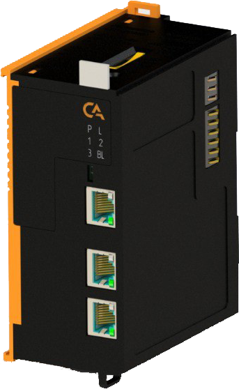
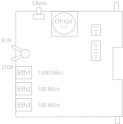
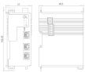
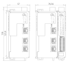

# Модуль основной SA-P5-GMB 

## Общие сведения
 
<!-- Модуль GMB - адаптивный блок -->

    <!-- Изображение -->
    

    <!-- Текст -->
    

        

            <strong>Наименование:</strong> 
            Модуль основной GMB
        

        
        

            <strong>Исполнения:</strong> 
            • SA-P5-GMB (без покрытия) 
            • SA-P5-GMB-V (с лаковым покрытием)
        

        
        

            <strong>Назначение:</strong> 
            Модуль основной GMB (далее-модуль) является центральным компонентом системы управления.
        

        
        

            <strong>Функции:</strong> 
            • выполнение пользовательской прикладной программы управления; 
            • обмен информацией со сторонними устройствами по встроенным интерфейсам; 
            • звуковое оповещение при загрузке данных и при сбросе настроек; 
            • опрос модулей расширения.
        

    

<!-- Описание + Интерактивная схема -->

    <!-- Описание -->
    

        
<strong>Описание:</strong>

        
На передней панели модуля расположен переключатель режима работы RUN/STOP, предназначенный для запуска и остановки выполнения цикла основной программы.

        
Для сброса до заводских настроек на верхней грани модуля предусмотрена скрытая кнопка «Сброс». Необходимо нажать на кнопку тонким заостренным предметом и удерживать до появления трех звуковых сигналов, подтверждающих выполнение сброса.

    

    
    <!-- Интерактивная схема -->
    

        
        
        <!-- Точка на батарейке -->
        

            
            
Батарейка

        

        
        <!-- Точка на кнопке СРОС -->
        

            
            
Кнопка Сброс

        

        
        <!-- Точка на переключателе РАН/СТОП -->
        

            
            
Переключатель RUN/STOP

        

    

<!-- Дополнительный текст — теперь он идёт ПОСЛЕ схемы, в потоке документа -->

Также для обеспечения автономной работы часов реального времени при отключении основного питания на верхней грани корпуса модуля предусмотрен разъём под батарейку типа CR1620.

  

    &times;
    <video controls loop muted playsinline>
      <source src="img/animation/battery.mp4" type="video/mp4">
      Ваш браузер не поддерживает видео тег.
    </video>
    
Батарейка

  

  

    &times;
    <video controls loop muted playsinline>
      <source src="img/animation/reset.mp4" type="video/mp4">
      Ваш браузер не поддерживает видео тег.
    </video>
    
Кнопка Сброс

  

  

    &times;
    <video controls loop muted playsinline>
      <source src="img/animation/run_stop.mp4" type="video/mp4">
      Ваш браузер не поддерживает видео тег.
    </video>
    
Переключатель RUN/STOP

  

## Технические характеристики  

  <table class="responsive-table">
    <colgroup>
      <col class="col-parameter">
      <col class="col-value">
    </colgroup>
    <thead>
      <tr>
        <th class="header-cell">Характеристика</th>
        <th class="header-cell">Значение</th>
      </tr>
    </thead>
    <tbody>
      <tr>
        <td class="data-cell">Ядро</td>
        <td class="data-cell">4 x Cortex-A72</td>
      </tr>
      <tr>
        <td class="data-cell">Оперативная память, Гб</td>
        <td class="data-cell">4, DDR4</td>
      </tr>
      <tr>
        <td class="data-cell">Объем памяти, Гб</td>
        <td class="data-cell">8</td>
      </tr>
      <tr>
        <td class="data-cell vertical-middle">Поддерживаемые интерфейсы</td>
        <td class="data-cell">Ethernet 1000 Мбит/с – 1, Ethernet 100 Мбит/с – 2</td>
      </tr>
      <tr>
        <td class="data-cell">Операционная система</td>
        <td class="data-cell">Linux с RT патчем</td>
      </tr>
      <tr>
        <td class="data-cell">Диапазон входного напряжения, В</td>
        <td class="data-cell">от 19 до 29</td>
      </tr>
      <tr>
        <td class="data-cell">Номинальное напряжение питания, В</td>
        <td class="data-cell">24</td>
      </tr>
      <tr>
        <td class="data-cell">Наличие индикации питания, канала информационного обмена</td>
        <td class="data-cell">да</td>
      </tr>
      <tr>
        <td class="data-cell">Наличие индикации интерфейсов</td>
        <td class="data-cell">да</td>
      </tr>
      <tr>
        <td class="data-cell">Максимальная потребляемая мощность, Вт</td>
        <td class="data-cell">7,5</td>
      </tr>
      <tr>
        <td class="data-cell">Время выполнения цикла</td>
        <td class="data-cell">Менее 1 мс</td>
      </tr>
      <tr>
        <td class="data-cell">Масса, кг</td>
        <td class="data-cell">0,34</td>
      </tr>
      <tr>
        <td class="data-cell">Размеры (Ш х В х Г), мм</td>
        <td class="data-cell">57,1х130,9x98,0</td>
      </tr>
    </tbody>
  </table>

## Эксплуатационные характеристики 

  <table style="border-collapse: collapse; width: 100%; min-width: 100%; table-layout: fixed; margin-bottom: 0;">
    <colgroup>
      <col style="width: 500px;">   <!-- Параметр -->
      <col style="width: 250px;">   <!-- Без лака -->
      <col style="width: 250px;">   <!-- С лаком -->
    </colgroup>
    <thead>
      <tr>
        <th rowspan="2" style="text-align: center; vertical-align: middle; padding: 8px; border: 1px solid #ccc;">Параметр</th>
        <th colspan="2" style="text-align: center; vertical-align: middle; padding: 8px; border: 1px solid #ccc;">Значение фактора</th>
      </tr>
      <tr>
        <th style="text-align: center; padding: 8px; border: 1px solid #ccc;">Без лака</th>
        <th style="text-align: center; padding: 8px; border: 1px solid #ccc;">С лаком</th>
      </tr>
    </thead>
    <tbody>
      <tr>
        <td style="padding: 8px; border: 1px solid #ccc;">Температура среды, °С</td>
        <td colspan="2" style="text-align: center; vertical-align: middle; padding: 8px; border: 1px solid #ccc;">от минус 40 до 60</td>
      </tr>
      <tr>
        <td style="padding: 8px; border: 1px solid #ccc;">Относительная влажность воздуха, %</td>
        <td style="text-align: center; vertical-align: middle; padding: 8px; border: 1px solid #ccc;">от 5 до 70</td>
        <td style="text-align: center; vertical-align: middle; padding: 8px; border: 1px solid #ccc;">от 5 до 95</td>
      </tr>
      <tr>
        <td style="padding: 8px; border: 1px solid #ccc;">Атмосферное давление, кПа</td>
        <td colspan="2" style="text-align: center; vertical-align: middle; padding: 8px; border: 1px solid #ccc;">от 84,0 до 106,7</td>
      </tr>
      <tr>
        <td style="padding: 8px; border: 1px solid #ccc;">Вибрация <em>амплитуда, не более</em></td>
        <td colspan="2" style="text-align: center; vertical-align: middle; padding: 8px; border: 1px solid #ccc;">0,35 мм с частотой 55 Гц</td>
      </tr>
    </tbody>
  </table>

## Индикация 

  <table style="border-collapse: collapse; width: 100%; min-width: 100%; table-layout: fixed;">
    <colgroup>
      <col style="width: 200px;">   <!-- Параметр -->
      <col style="width: 200px;">   <!-- Без лака -->
      <col style="width: 600px;">   <!-- С лаком -->
    </colgroup>
      <thead>
        <tr>
          <th style="text-align: center; padding: 8px; border: 1px solid #ccc;">Обозначение</th>
          <th style="text-align: center; padding: 8px; border: 1px solid #ccc;">Индикация</th>
          <th style="text-align: center; padding: 8px; border: 1px solid #ccc;">Показатель</th>
        </tr>
      </thead>
      <tbody>
        <tr>
          <td style="text-align: center; padding: 8px; border: 1px solid #ccc;">P</td>
          <td style="text-align: center; padding: 8px; border: 1px solid #ccc;"></td>
          <td style="padding: 8px; border: 1px solid #ccc;">Наличие напряжения питания</td>
        </tr>
        <tr>
          <td style="text-align: center; padding: 8px; border: 1px solid #ccc;">P</td>
          <td style="text-align: center; padding: 8px; border: 1px solid #ccc;"></td>
          <td style="padding: 8px; border: 1px solid #ccc;">Отсутствие напряжения питания</td>
        </tr>
        <tr>
          <td style="text-align: center; padding: 8px; border: 1px solid #ccc;">L</td>
          <td style="text-align: center; padding: 8px; border: 1px solid #ccc;"></td>
          <td style="padding: 8px; border: 1px solid #ccc;">Наличие соединения по Ethernet</td>
        </tr>
        <tr>
          <td style="text-align: center; padding: 8px; border: 1px solid #ccc;">L</td>
          <td style="text-align: center; padding: 8px; border: 1px solid #ccc;"></td>
          <td style="padding: 8px; border: 1px solid #ccc;">Обмен данными по Ethernet</td>
        </tr>
        <tr>
          <td style="text-align: center; padding: 8px; border: 1px solid #ccc;">L</td>
          <td style="text-align: center; padding: 8px; border: 1px solid #ccc;"></td>
          <td style="padding: 8px; border: 1px solid #ccc;">Отсутствие соединения по Ethernet</td>
        </tr>
        <tr>
          <td style="text-align: center; padding: 8px; border: 1px solid #ccc;">L</td>
          <td style="text-align: center; padding: 8px; border: 1px solid #ccc;"></td>
          <td style="padding: 8px; border: 1px solid #ccc;">Модуль в рабочем состоянии</td>
        </tr>
        <tr>
          <td style="text-align: center; padding: 8px; border: 1px solid #ccc;">L</td>
          <td style="text-align: center; padding: 8px; border: 1px solid #ccc;"></td>
          <td style="padding: 8px; border: 1px solid #ccc;">Выполнение загрузки</td>
        </tr>
        <tr>
          <td style="text-align: center; padding: 8px; border: 1px solid #ccc;">1 - 3</td>
          <td style="text-align: center; padding: 8px; border: 1px solid #ccc;"></td>
          <td style="padding: 8px; border: 1px solid #ccc;">Пользовательский светодиод 1 - 3 включен</td>
        </tr>
        <tr>
          <td style="text-align: center; padding: 8px; border: 1px solid #ccc;">1 - 3</td>
          <td style="text-align: center; padding: 8px; border: 1px solid #ccc;"></td>
          <td style="padding: 8px; border: 1px solid #ccc;">Пользовательский светодиод 1 - 3 выключен</td>
        </tr>
        <tr>
          <td style="text-align: center; padding: 8px; border: 1px solid #ccc;">BL</td>
          <td style="text-align: center; padding: 8px; border: 1px solid #ccc;"></td>
          <td style="padding: 8px; border: 1px solid #ccc;">Низкое напряжение питания</td>
        </tr>
        <tr>
          <td style="text-align: center; padding: 8px; border: 1px solid #ccc;">BL</td>
          <td style="text-align: center; padding: 8px; border: 1px solid #ccc;"></td>
          <td style="padding: 8px; border: 1px solid #ccc;">Рабочее напряжение питания</td>
        </tr>
      </tbody>
  </table>

## Размеры

=== "Габаритные размеры" 
    { width="580"}
=== "Установочные размеры"
    { width="580"}

## Файлы для скачивания
<a href="/downloads/proplc.package" download>Пакет таргет файлов для CODESYS v3</a>  