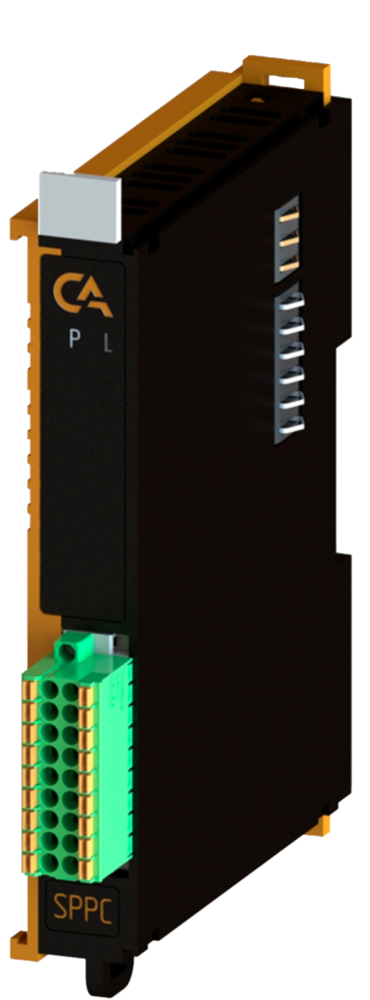

# Модуль измерения частоты PICCO-P5-SPFM

## Общие сведения


<div class="grid cards" markdown>

{ width="150" align=left  }
Модуль измерения частоты (арт. PICCO-P5-SPFM) является 4-х канальным модулем расширения и предназначенный для точного измерения частоты/периода входных сигналов
</div>

## Технические характеристики 
| Характеристика                          | Значение                          |
|-----------------------------------------|-----------------------------------|
| Максимальная потребляемая мощность,не более, Вт  | 3                                 |
| Количество входных каналов              | 4                                 |
| Диапазон частоты, Гц          |  до 200000                    |
| Номинальное входное напряжение  счета импульсов, В | 3 … 24 |
| Гальваническая изоляция                 | Между входной и выходной логикой  |
| Сечение проводника, мм²                 | От 0,2 до 1,5                     |
| Масса, г                                | 120                               |
| Габариты ВхШхГ, мм                      | 126х21х90                         |

## Эксплуатационные характеристики
| Характеристика                   | Значение           |
| -------------------------------- | -                  |
| Температура эксплуатации, °С     | От минус 40 до 60  |
| Температура хранения, °С         | От минус 40 до 60  |
| Влажность при хранении, %	       | От 5 до 95         |
| Влажность при эксплуатации, %    | От 5 до 95         |
| Тип монтажа                      | На DIN-рейку 35 мм |
| Расположение при монтаже         | Вертикальное       |

## Схема подключения
<div class="grid cards" markdown>
{ width="370"; align=left  }

{ width="170";  }
</div>

| Обозначение | Наименование канала | Описание                                         |
|-------------|---------------------|--------------------------------------------------|
| 1           | F1+                 | Плюс устройства 1                                |
| 2           | F1-                 | Минус устройства 1                               |
| 3           | NC                  | Не используется                |
| 4           | NC                  | Не используется                |
| 5           | F2+                 | Плюс устройства 2                                |
| 6           | F2-                 | Минус устройства 2                               |
| 7           | NC                  | Не используется                |
| 8           | NC                  | Не используется                |
| 9           | F3+                 | Плюс устройства 3                                |
| 10          | F3-                 | Минус устройства 3                               |
| 11          | NC                  | Не используется                |
| 12          | NC                  | Не используется                |
| 13          | F4+                 | Плюс устройства 4                                |
| 14          | F4-                 | Минус устройства 4                               |
| 15          | NC                  | Не используется                |
| 16          | NC                  | Не используется                |
| 17          | GND                 | Подключение экранирующей оплетки     |
| 18          | GND                 | Подключение экранирующей оплетки     |

## Индикация
| Обозначение | Индикация | Показатель |
|------------------|----------------------|---------------------------------------|
| P | :green_circle:| Наличие напряжения питания |
| P | :white_circle:| Отсутствие напряжения питания |
| L | :green_circle:| Наличие соединения Ethernet |
| L | :yellow_circle: :green_circle: :yellow_circle: | Обмен данными по Ethernet |
| L | :white_circle:| Отсутствие соединения Ethernet|

## Размеры
=== "Габаритные размеры" 
    { width="580"}
=== "Установочные размеры"
     

## 3D-модель
<model-viewer src="https://manual.saplc.ru//img/3d/DI.glb"
alt="3D Model"
auto-rotate
camera-controls
poster="https://manual.saplc.ru//img/3d/posterDI.webp"
camera-orbit="160deg 75deg 348m"
field-of-view="30deg"
exposure="0.5"
style="width: 100%; height: 500px;">
</model-viewer>

## Программное обеспечение
Обмен данными осуществляется с использованием объектов PDO (Process Data Objects) для оперативного мониторинга значений и SDO (Service Data Objects) для настройки параметров каналов.

### PDO (Process Data Objects)
Модуль предоставляет четыре выходных канала, каждый из которых содержит текущее значение измеренной частоты.

Структура PDO:
```
|─ Outputs
     |─ Channel 1 (Частота, Гц)
     |─ Channel 2 (Частота, Гц)
     |─ Channel 3 (Частота, Гц)
     |─ Channel 4 (Частота, Гц)

```

 **Назначение:** 
Передача текущих измеренных значений частоты в виде 4-байтных целых чисел.

### SDO (Service Data Objects)
Для каждого канала доступны три уровня фильтрации шума, задаваемых через SDO. 

Структура SDO:

```
|─ Settings
|     |─ Channel 1
|     |     |─ Noise level 
|     |     |     |─ Low
|     |     |     |─ Middle (По умолчанию)
|     |     |     |─ High  
|     |─ Channel 2 (аналогично)
|     |─ Channel 3 (аналогично)
|     |─ Channel 4 (аналогично)

```

### Принцип работы
Установкой значения "Noise level" мы устанавливаем соотношение сигнал/шум входного сигнала.

### Пример конфигурации
Установить Noise level в значение High через SDO.
Это означает, что входной сигнал сильно зашумлен.

Прочитать значение через TxPDO (например, 100240 Гц).


