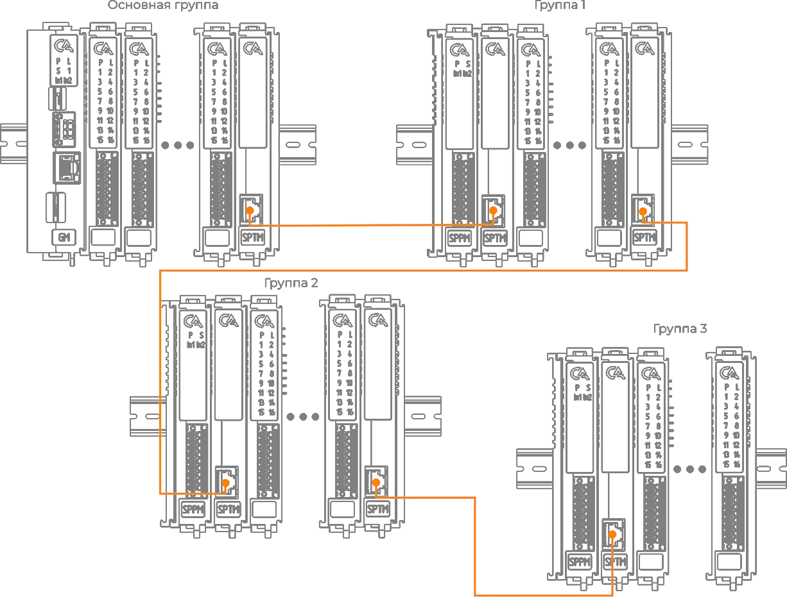
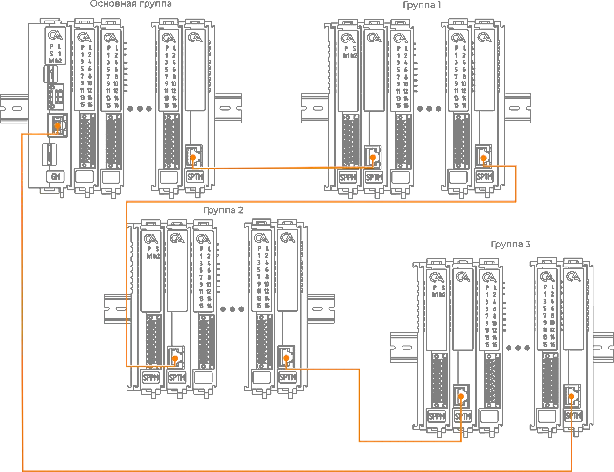
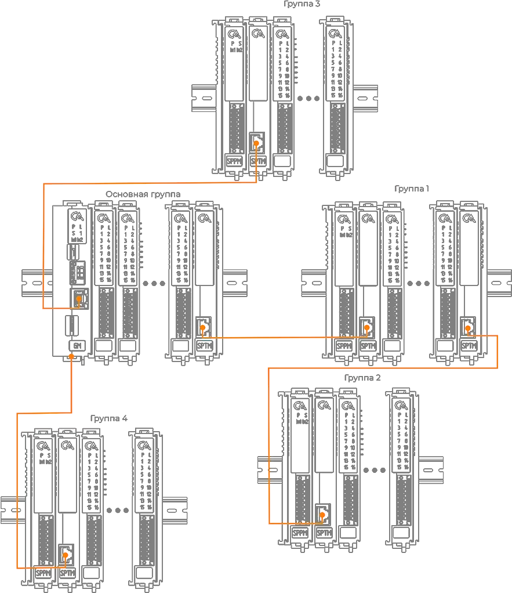
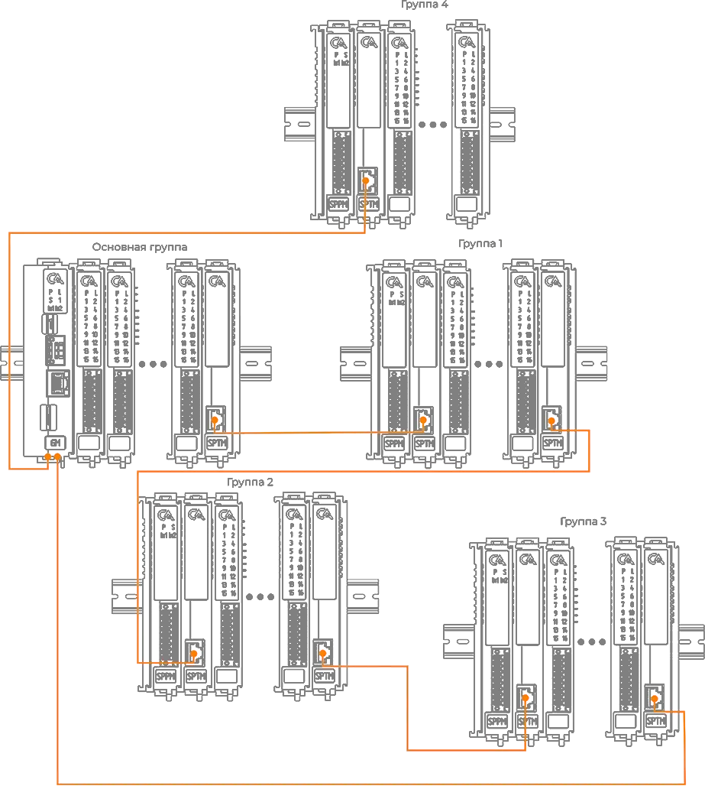

# Составление сборки

!!! warning "Важно"
    Допустимое расстояние между модульными группами, соединенными одним кабелем, определяется типом модуля оконечного или модуля расширения коммутации. Если используются модули с интерфейсом RJ45, то длина кабеля не должна превышать 100 метров. В случае использования модулей с интерфейсом SFP расстояние определяется характеристиками SFP модулей.

!!! note "Примечание"
    Для организации разветвленных соединений в сложных топологиях (кольцо, дерево, смешанная) используется [Модуль расширения коммутации SPSE](SPSE.md)

## Сборка «Шина» {#_1}
Сборка «Шина» составляется из нескольких модульных групп. Первая группа содержит основноой модуль, последующие группы подключаются при помощи кабеля через оконечные модули.

## Сборка «Кольцо» {#_2}
Сборка «Кольцо» составляется путем соединения модульных групп в замкнутый контур, где кабель выходит из группы с основным модулем и возвращается в нее же, образуя кольцо.

Ключевые особенности сборки:

- [поддержка функции "горячей" замены модулей](power_organization.md#"Горячая"-замена-модулей), что позволяет монтировать и демонтировать модули, не прерывая работу контроллера.
- резервирование шины, обеспечивющее непрерывную работу системы в случае отказа одного из модулей.

## Сборка «Древовидная» {#_3}
Сборка «Древовидная» составляется таким образом, что одна модульная группа служит точкой соединения для нескольких других модульных групп, расположенных на большом удалении.

  

## Сборка «Смешанная» {#_4}
«Смешанная» сборка позволяет совместить вышеуказанные типы сборок. 

  
