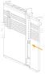
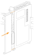
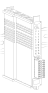
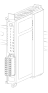
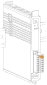

# Сборка контроллера
Контроллер представляет собой модульную систему, состоящую из **модулей расширения**, работающих с сигналами, и **специальных модулей расширения**, обеспечивающих работу контроллера в гибких конфигурациях.
Для правильной и бесперебойной работы контроллера необходимо выполнить ряд требований при его сборке. К этим требованиям относятся:

- правильная последовательность модулей в группе
- организация питания в группе
- организация подключения групп

!!! success "Рекомендация"
    Правильная сборка позволяет обеспечить работу таких функций, как [горячая замена модулей](#_1) и [резервирование питания контроллера](#_2)

## Последовательность модулей в группе

Сборка группы, включающей в себя основной модуль, должна начинаться с установки [Модуля ввода питания SPPM](SPPM.md). Вторым модулем всегда устанавливается основной модуль, после чего устанавливаются модули расширения.

    

!!! warning "Обратите внимание"
    На первый и последний модули в группе в обязательном порядке устанавливается заглушка

Сборка группы, **не включающей** в себя основной модуль, должна начинаться с оконечного модуля. Вторым в такой группе устанавливается [Модуль ввода питания SPPM](SPPM.md), после чего устанавливаются модули расширения в соответствии с [организацией питания в группах]().

    

    
Для расширения контроллера последующими группами или подключения по схеме [«Кольцо»](#_3), в конце группы устанавливается модуль оконечный.

!!! success "Рекомендация"
    Рекомендуем в любом случае ставить модуль оконечный в конце группы для дальнейшего подключения по схеме [«Кольцо»](#_3)

## Организация питания в группе

Правильная организация питания в группе позволяет реализовать функции ["горячей" замены модулей](#_1) и [резервирование питания](#_2) контроллера и обеспечивает бесперебойную работу контроллера.

[Модуль ввода питания SPPM](SPPM.md) обеспечивает питание всех остальных модулей контроллера. Он позволяет запитать до **48 Вт** нагрузки. Базово [Модуль ввода питания SPPM](SPPM.md) питает установленные справа от него модули, однако, если установлена перемычка он питает как установленные справа, так и установленные слева от него модули, но максимальная мощность питания остается неизменной - 48 Вт.

Потребляемая мощность всех модулей приведена ниже:

<table class="compact-center">
  <thead>
    <tr>
      <th>Наименование модуля</th>
      <th>Максимальная потребляемая мощность, Вт</th>
    </tr>
  </thead>
  <tbody>
    <tr><td>GMB</td><td>7,5</td></tr>
    <tr><td>DI</td><td>5</td></tr>
    <tr><td>DO</td><td>3</td></tr>
    <tr><td>AIC</td><td>4</td></tr>
    <tr><td>AIV</td><td>2,5</td></tr>
    <tr><td>AITC</td><td>5,5</td></tr>
    <tr><td>AITR</td><td>2,5</td></tr>
    <tr><td>AO</td><td>7,5</td></tr>
    <tr><td>SPPC</td><td>3</td></tr>
    <tr><td>SPPM</td><td>0,5</td></tr>
    <tr><td>SPTM</td><td>0</td></tr>
    <tr><td>IF485/422</td><td>2,5</td></tr>
  </tbody>
</table>

### Организация питания без функции "горячей" замены модуля

При организации питания без поддержки "горячей" замены модулей должно выполняться следующее правило:

Сумма потребляемой мощности всех модулей расширения, стоящих справа от рассматриваемого [Модуля ввода питания SPPM](SPPM.md) до следующего, **включая сам модуль ввода питания**, не должна превышать 48 Вт. 

    

!!! Example "Пример"
    Например, после первого Модуля SPPM мы поставили:

    _- 1 GMB (7,5 Вт)_

    _- 2 АО (2×7,5 Вт)_

    _- 2 DI (2×5 Вт)_

    _- 4 DO (4×3 Вт)_

    _- и не забыли про то, что Модуль ввода питания потребляет 0,5 Вт_

    Таким образом, суммарная потребляемая мощность модулей будет равна:

    _P = 7,5 + 2×7,5 + 2×5 + 4×3 + 0,5 = 45 Вт_

    Что меньше 48, следовательно, правило соблюдается :)

### Организация питания с функцией "горячей" замены модуля

При организации питания с поддержкой **"горячей" замены модулей** каждый [Модуль ввода питания](SPPM.md) отвечает за питание двух зон модулей в группе:

1. Модули расширения, расположенные справа от рассмативаемого до следующего [Модуля ввода питания SPPM](SPPM.md)
2. Модули расширения, расположенные слева от рассмативаемого до следующего [Модуля ввода питания SPPM](SPPM.md)

Каждый [Модуль ввода питания](SPPM.md) устанавливается из расчета, что он питает обе зоны, то есть потребляемая мощность модулей расширения в этих двух зонах, включая сам [Модуль ввода питания](SPPM.md), не должна превышать 48 Вт.
В расчет потребляемой мощности не включается самый левый модуль в левой зоне.

!!! info "Информация"
    В нормальном режиме функционирования [Модуль ввода питания](SPPM.md) питает только правую зону, однако в момент ["горячей" замены](#_1) модулей, он также начинает питать и зону слева от него

    

При сборке группы с функцией ["горячей" замены](#_1) модулей рекомендуем устанавливать перемычку на [Модулях ввода питания SPPM](SPPM.md) сразу.

## Резервирование питания контроллера {#_2}
Организация питания контроллера с резервированием позволяет обеспечить непрерывную работу контроллера в случаях, когда один из источников питания неисправен.

На вход [Модулей ввода питания](SPPM.md) подается напряжение **24 В** от двух резервирующих друг друга источников. Модули осуществляют их автоматическую коммутацию для подачи напряжения на общую шину. Приоритетным для подключения является источник с нормальными параметрами, что обеспечивает бесперебойное электропитание системы.

!!! success "Рекомендация"
    Контроллер может работать от одного источника питания **без** резервирования, однако рекомендуем всегда организовывать питание с применением данной функции.

Для бесперебойной работы ["горячей" замены модулей](#_1) необходимо придерживаться следующего правила: на каждый [Модуль ввода питания SPPM](SPPM.md), расположенных в одной группе, подается питание от одних и тех же источников питания. 

!!! info "Информация"
    Питание **других** групп может осуществляться как от других источников питания, так и от этих же.

    

## "Горячая" замена модулей {#_1}

"Горячая" замена модулей позволяет заменить вышедшие из строя модулей расширения (или плановой замены модулей) без остановки работы всего контроллера. 

Для "горячей" замены необходимо выполнение следующих условий:

- подключение контроллера по топологии ["Кольцо"](#_3)
- организация питания с поддержкой "горячей" замены модулей
- питание всех модулей [SPPM](SPPM.md) в группе от одних и тех же блоков питания

Порядок "горячей" замены модулей:

В случае, если на модулях SPPM, расположенных в группе уже стоит перемычка, [демонтируйте]() неисправный модуль, и [установите]() исправный на то же место.

!!! success "Полезно"
    Для замены нерабочего модуля нет необходимости демонтировать рабочие.

В случае, если на модулях SPPM, расположенных в группе не установлены перемычки, установите перемычки на модули SPPM, [демонтируйте]() неисправный модуль, и [установите]() исправный на то же место.

## Сборка контроллера из групп

Контроллер программируемый логический СА поддерживает все топологии обмена данными между группами.

Для организации разветвленных соединений в сложных топологиях (дерево, звезда, смешанная) используется [Модуль расширения коммутации SPSE](SPSE.md). Организация линейных соединений осуществлятся при помощи модулей оконечных, установленных в начале и в конце каждой группы.

!!! info "Важно"
    Допустимое расстояние между группами, соединенными кабелем, определяется типом оконечного модуля или модуля расширения коммутации. Если используются модули с интерфейсом RJ45, то длина кабеля не должна превышать 100 метров. В случае использования модулей с интерфейсом SFP расстояние определяется характеристиками SFP модулей.

### Сборка "Кольцо" {#_3}

Сборка «Кольцо» составляется путем последовательного соединения групп в "замкнутый" контур: кабель выходит из конца каждой группы и заходит в начало следующей, при этом последняя группа в "кольце" замыкается на первую группу, образуя тем самым "кольцо".

Ключевые особенности сборки:

- поддержка функции ["горячей"](#_1) замены модулей, что позволяет заменять модули, не прерывая работу контроллера.
- резервирование шины, обеспечивающее непрерывную работу системы в случае отказа одного из модулей.

!!! success "Рекомендация"
    При сборке "кольца" верхний порт **Модуля основного GMB** рекомендуем оставлять свободным для подключения к нему высокоскоростных внешних устройств.

    

!!! Example "На рисунке приведен пример сборки контроллера со "смешанной" топологией"
     Группы 1, 2, 3 и 4 последовательно подключены друг к другу, при этом группа 4 подключена к Модулю основному GMB, образуя тем самым сборку "кольцо". Для этих груп действует "горячая" замена модулей и в случае выхода из строя одного из модулей, контроллер сохранит работоспособность.

     Обратите внимание, что группа 5 в схеме "кольцо" не участвует. К контроллеру она подключена через модуль расширения коммутации, расположенного в группе 4