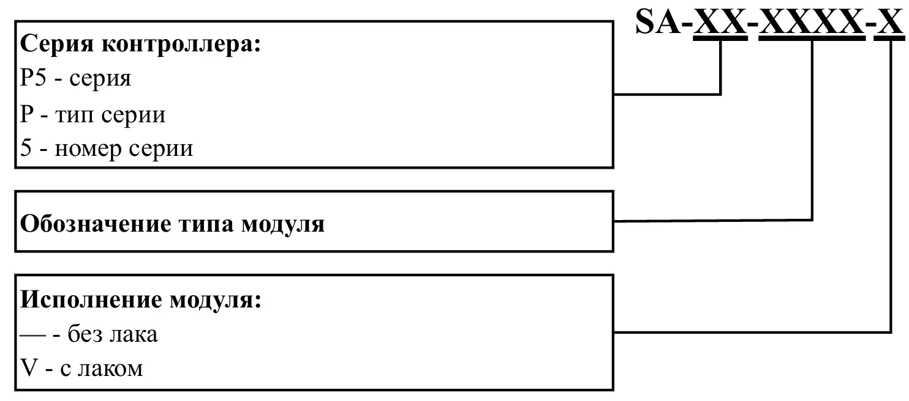

# Основные сведения
## Назначение
Контроллер программируемый логический СА серии P5 (далее - контроллер) предназначен для сбора и обработки информации с датчиков, формирования сигналов управления по заданным алгоритмам, приема и передачи информации по каналам связи.

Условное обозначение контроллера состоит из условных обозначений модулей, входящих в его состав. Условное обозначение модулей контроллера формируется следующим образом:

{: style="width:70%; display:block; margin:auto;"}

## Принцип работы
Принцип работы контроллера основан на преобразовании измерительных сигналов в цифровые данные в модулях ввода, передаче данных по внутренней шине в модуль основной или другие внешние системы через коммутационные интерфейсы, обработке кода в соответствии с алгоритмом прикладной программы и выдаче управляющих сигналов посредством модулей вывода.

## Программное обеспечение

Обеспечение связи между устройствами осуществляется с помощью протокола EtherCAT— технологии, основанной на стандарте Ethernet, но оптимизированной для промышленного управления в реальном времени.

В отличие от традиционной Ethernet-сети, где master устройство опрашивает каждое slave устройство отдельными командами, в EtherCAT master отправляет о интерфейсу один запрос, который проходит через каждое slave-устройство. При этом slave «на лету» считывает из запроса предназначенные ему данные и вставляет в него данные, которые нужно передать дальше. Последнее устройство в сети обнаруживает, что ни к чему не подключено, и пересылает датаграмму обратно master-устройству, используя полнодуплексный режим работы Ethernet.

Такой механизм позволяет на высокой скорости управлять до 65535 устройств в одной сети без ограничения в топологии сети. Причем для организации различных топологий не нужны хабы или коммутаторы.

<!DOCTYPE html>
<html lang="ru">
<head>
    <meta charset="UTF-8">
    <meta name="viewport" content="width=device-width, initial-scale=1.0">
    <title>EtherCAT Data Train</title>
    
</head>
<body>
    

        <h2>EtherCAT Data Transfer - "Поезд данных"</h2>
        
        

            

                <!-- Master -->
                

                    
Master

                    

                        
?

                    

                

                
                <!-- Slaves -->
                

                    
Slave 1

                    

                        
IN

                        
OUT

                    

                

                
                

                    
Slave 2

                    

                        
IN

                        
OUT

                    

                

                
                

                    
Slave 3

                    

                        
OUT

                    

                

                
                

                    
Slave 4

                    

                        
IN

                        
OUT

                    

                

            

            
            <!-- Поезд -->
            

                

                

                

                

                

                

                

            

        

        
        

            <button id="startBtn">▶ Запуск поезда</button>
            <button id="stopBtn" disabled>⏹ Остановить</button>
            <button id="resetBtn">↺ Сброс</button>
            
Готов к отправке

        

        
        

            <strong>Как работает:</strong> Поезд (EtherCAT фрейм) движется по сети, забирая выходные данные (OUT) у Slave устройств 
            и доставляя им входные данные (IN). В конце маршрута поезд возвращается к Master со всеми собранными данными.
        

    

    
</body>
</html>

В протоколе EtherCAT для обмена данными между master устройством и slave устройствами используются два основных механизма: PDO (Process Data Object) и SDO (Service Data Object), которые заимствованы из профиля CoE (CANopen over EtherCAT).

PDO предназначен для циклического, высокоскоростного обмена процессными данными в режиме реального времени. Перед началом работы система настраивается: master указывает, какие переменные из объектного словаря (Object Dictionary - OD) каждого устройства должны автоматически передаваться в каждом цикле EtherCAT. После этого данные передаются без запросов, без адресации и без подтверждений — в строго определённые временные окна, встроенные в цикл сети. PDO делятся на TxPDO ( Transmit PDO) — данные, отправляемые от slave к master, и RxPDO (Receive PDO) — данные, передаваемые от master к slave.

SDO предназначен для ацикличного обмена данными. С его помощью осуществляется чтение и запись параметров устройства, хранящихся в объектном словаре. В отличие от PDO, SDO работает по принципу «запрос-ответ»: master отправляет команду, slave её обрабатывает и возвращает результат.

## Условия эксплуатации

<table border="1" style="border-collapse: collapse; width: 100%;">
<thead>
<tr>
<th rowspan="2" style="text-align: center; vertical-align: middle; padding: 4px;">Воздействующие факторы</th>
<th rowspan="2" style="text-align: center; vertical-align: middle; padding: 4px;">Характеристики воздействующих факторов</th>
<th colspan="2" style="text-align: center; vertical-align: middle; padding: 4px;">Значение фактора</th>
</tr>
<tr>
<th style="text-align: center; padding: 4px;">Без лака</th>
<th style="text-align: center; padding: 4px;">С лаком</th>
</tr>
</thead>
<tbody>
<tr>
<td rowspan="2" style="vertical-align: middle;" ><strong>1. Синусоидальная вибрация</strong></td>
<td>Амплитуда перемещения, мм</td>
<td colspan="2" style="text-align: center; vertical-align: middle; ">0,35</td>
</tr>
<tr>
<td>Диапазон частот, Гц</td>
<td colspan="2" style="text-align: center; vertical-align: middle;">от 10 до 55</td>
</tr>
<tr>
<td><strong>2. Повышенная температура среды</strong></td>
<td style="vertical-align: middle;">Рабочая, °С</td>
<td colspan="2" style="text-align: center; vertical-align: middle;">60</td>
</tr>
<tr>
<td><strong>3. Пониженная температура среды</strong></td>
<td style="vertical-align: middle;">Рабочая, °С</td>
<td colspan="2" style="text-align: center; vertical-align: middle;">минус 40</td>
</tr>
<tr>
<td><strong>4. Атмосферное давление</strong></td>
<td style="vertical-align: middle;">Рабочее, кПа (мм рт. ст.)</td>
<td colspan="2" style="text-align: center; vertical-align: middle;">от 84,0 до 106,7 (от 630 до 800)</td>
</tr>
<tr>
<td><strong>5. Повышенная влажность</strong></td>
<td>Относительная влажность воздуха при температуре 35°С, %</td>
<td style="text-align: center; vertical-align: middle;"> 70</td>
<td style="text-align: center; vertical-align: middle;">95</td>
</tr>
</tbody>
</table>

## Меры безопасности 

По способу защиты от поражения электрическим током модули контроллера соответствуют классу II по ГОСТ Р 58698-2019. 

Для обеспечения дополнительной защиты от поражения электрическим током  в модуле ввода питания предусмотрено заземление.

Во время эксплуатации и технического обслуживания прибора необходимо соблюдать требования
ГОСТ 12.3.019-80, «Правил эксплуатации электроустановок потребителей» и «Правил охраны труда
при эксплуатации электроустановок потребителей».

Не допускается попадание влаги на контакты выходного разъема и внутренние электроэлементы
прибора.

Любые подключения к прибору и работы по его техническому обслуживанию производить только при
отключенном питании прибора и подключенных к нему устройств.

## Техническое обслуживание 

Техническое обслуживание контроллера заключается в профилактическом осмотре модулей, состояния разъемов и периодической поверке аналоговых каналов преобразования и воспроизведения. 

Периодичность профилактических осмотров при техническом обслуживании - один раз в год. При осмотре контроллера производится: 

- проверка отсутствия внешних повреждений, влияющих на функциональные или технические характеристики контроллера; 
- проверка надежности контактов соединителей. При необходимости винтовые зажимы подтягиваются, удаляется пыль методом продувки сжатым воздухом. 

Аналоговые каналы контроллера подлежат периодической поверке для обеспечения единства измерения с требуемой точностью. Интервал между поверками – 5 лет. Записи о проведенной поверке заносятся в паспорт на модуль.

## Маркировка

На корпус каждого модуля контроллера наносится по 4 наклейки, на которых должна быть отображена следующая информация:

- товарный знак;
- наименование модуля;
- артикул изделия;
- заводской номер;
- QR Code по ГОСТ Р ИСО/МЭК 18004-2015 с заводским номером;
- страна-изготовитель;
- единый знак обращения продукции на рынке государств-членов Таможенного союза (ЕАС) – при наличии сертификата (декларации) Таможенного союза на изделие;
- знак средства измерения – при наличии сертификата типа средства измерения;
- потребляемая мощность;
- напряжение питания;
- год выпуска.

На упаковку изготовителя наносится наклейка, в которую должны входить:

- товарный знак или код изготовителя;
- наименование модуля;
- артикул изделия;
- заводской номер;
- QR Code по ГОСТ Р ИСО/МЭК 18004-2015 с заводским номером;
- единый знак обращения продукции на рынке государств-членов Таможенного союза (ЕАС) – при наличии сертификата (декларации) Таможенного союза на изделие;
- знак средства измерения – при наличии сертификата типа измерения на изделие; 
- сведения о местонахождении изготовителя (адрес, включая страну);
- дата упаковки.

## Упаковка

Каждый модуль контроллера упаковывается в отдельную потребительскую тару. В качестве упаковки изготовителя используются ящики или коробки из гофрированного картона. Первым, под ложемент, в коробку помещается паспорт. После паспорта размещается ложемент. Комплект монтажных частей помещается в коробку в отсеки ложемента. Модуль помещается горизонтально маркировочными наклейками вверх.

## Транспортирование и хранение

Транспортирование модулей контроллера производится в упаковке изготовителя в соответствии с разделом "Упаковка". Модули контроллера могут транспортироваться на любые расстояния всеми видами транспорта в крытых транспортных средствах в соответствии с правилами перевозки грузов, действующими на данном виде транспорта.

Модули контроллера хранить в упаковке изготовителя в соответствии с разделом "Упаковка", в крытых складских помещениях, защищённых от атмосферных осадков и почвенной влаги, на расстоянии не менее 1 метра от отопительных приборов в следующих условиях: при температурах от минус 14 °С до плюс 40 °С и относительной влажности воздуха от 25 % до 70 %.

