# Работа прибора с CODESYS V3.5

## Установка CODESYS V3.5

Для начала работы с прибором в среде программирования CODESYS V3.5 необходимо:

1. [Скачать архив](setup_preparation/CODESYS%2064%203.5.21.30.zip) для установки CODESYS.
2. Распакуйте архив в отдельную папку и запустите установщика с названием CODESYS Sandbox Prerequisites 3.5.21.30.

    В появившемся окне нажмите кнопку **Next**, чтобы начать установку.

    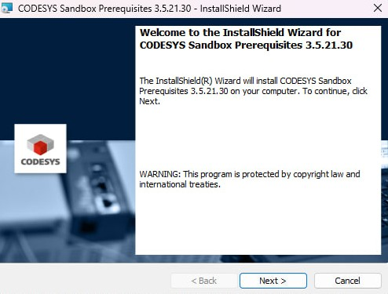{ width="400" style="display: block; margin-left: auto; margin-right: auto;" }

    В следующем окне ознакомьтесь с текстом лицензионного соглашения, выберите пункт **I accept the terms in the license agreement** и нажмите кнопку **Next**.

    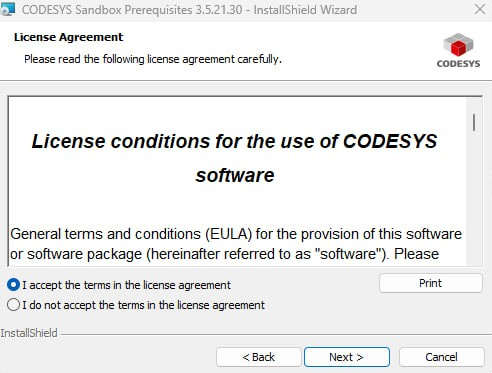{ width="400" style="display: block; margin-left: auto; margin-right: auto;" }

    В следующем окне нажмите кнопку **Install** для запуска процесса установки.

    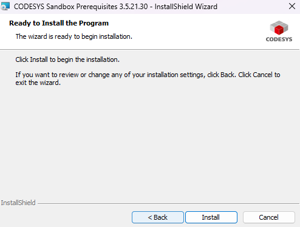{ width="400" style="display: block; margin-left: auto; margin-right: auto;" }

    Процесс установки занимает от нескольких минут до часа (в зависимости от характеристик ПК). В случае успешного завершения появится следующее окно:  

    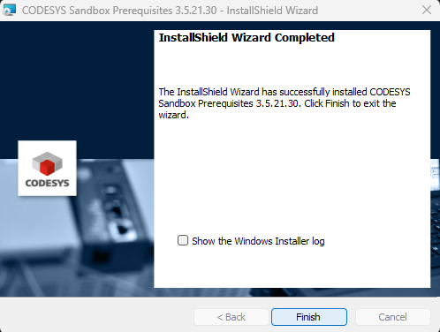{ width="400" style="display: block; margin-left: auto; margin-right: auto;" }

    Нажмите кнопку **Finish** для закрытия этого окна.

3. Для удаленного подключения к контроллеру установите [CODESYS Gateway](setup_preparation/CODESYS Gateway 3.5.21.30.exe).

    После запуска появиться стартовое окно установщика. Нажмите кнопку **Next**.

    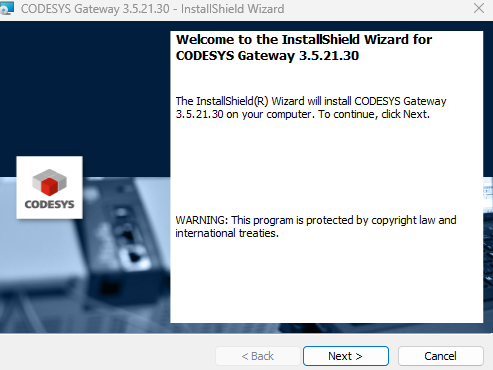{ width="400" style="display: block; margin-left: auto; margin-right: auto;" }

    В следующем окне ознакомьтесь с текстом лицензионного соглашения, выберите пункт I **accept the terms in the license agreement** и нажмите кнопку **Next**:

    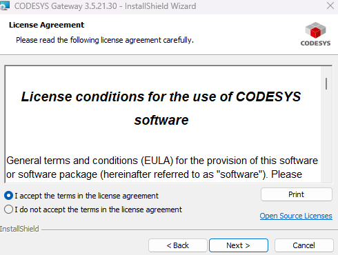{ width="400" style="display: block; margin-left: auto; margin-right: auto;" }

    Далее ознакомтесь с информацией о выпуске, после чего выберите пункт **I have read the information** и нажмите кнопку **Next**

    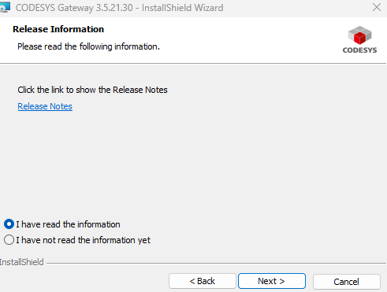{ width="400" style="display: block; margin-left: auto; margin-right: auto;" }

    В следующем окне выберите директорию, в которую будет установлен CODESYS, и нажмите кнопку **Next**

    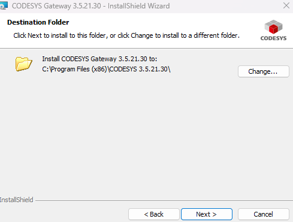{ width="400" style="display: block; margin-left: auto; margin-right: auto;" }

    Следующим шагом необходимо выбрать режим установки CODESYS. Укажите режим полной установки (Complete), чтобы установить все доступные плагины, и нажмите **Next**.

    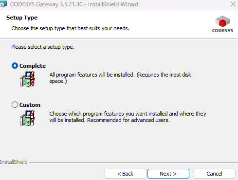{ width="400" style="display: block; margin-left: auto; margin-right: auto;" }

    В следующем окне нажмите кнопку **Install** для запуска процесса установки.

    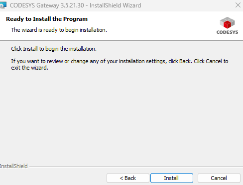{ width="400" style="display: block; margin-left: auto; margin-right: auto;" }

    После завершения установки в появившемся окне нажмите кнопку **Finish**, чтобы завершить процесс.

    { width="400" style="display: block; margin-left: auto; margin-right: auto;" }

4. Установка завершена. Для запуска программы откройте файл CODESYS 3.5 SP21 (64 Bit) Контроллер СА.

!!! note "Примечание"
    Файл программы рекомендуется открывать от имени администратора

## Настройка и работа CODESYS V3.5

Для создания нового проекта необходимо выбрать пункт **Новый проект..**. Если же вы хотите открыть существующий проект – то можно сделать это с помощью команды **Открыть проект**.

После этого откроется окно создания проектов. Выберите **Стандартный проект**.

В нижней части окна выберите имя файла проекта и директорию, в которой он будет сохранен, после чего нажмите **Ок**.

    

В следующем окне вы увидите список объектов, которые будут сосзданы для нового проекта. Нажмите **Ок**.

    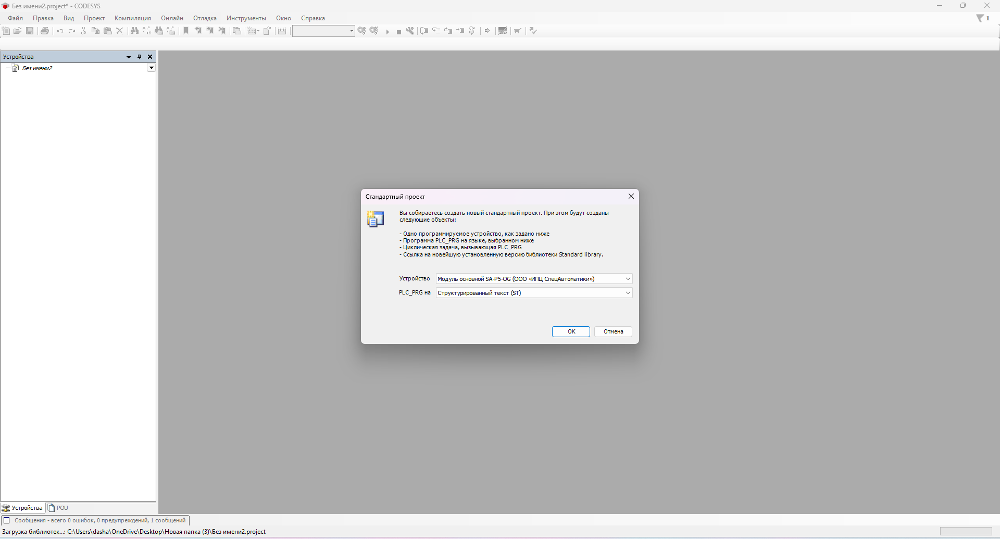

Интерфейс CODESYS выглядит следующим образом

    

В дереве проекта левой кнопкой мыши дважды кликните на узел **Device**.

 Затем нажмите **Scan network**. В появившемся списке следует выбрать нужный контроллер (sa[002A]) и установить связь, нажав **ОК**.
 
 В случае успешной установки связи индикаторы шлюза и контроллера загорятся зеленым.

    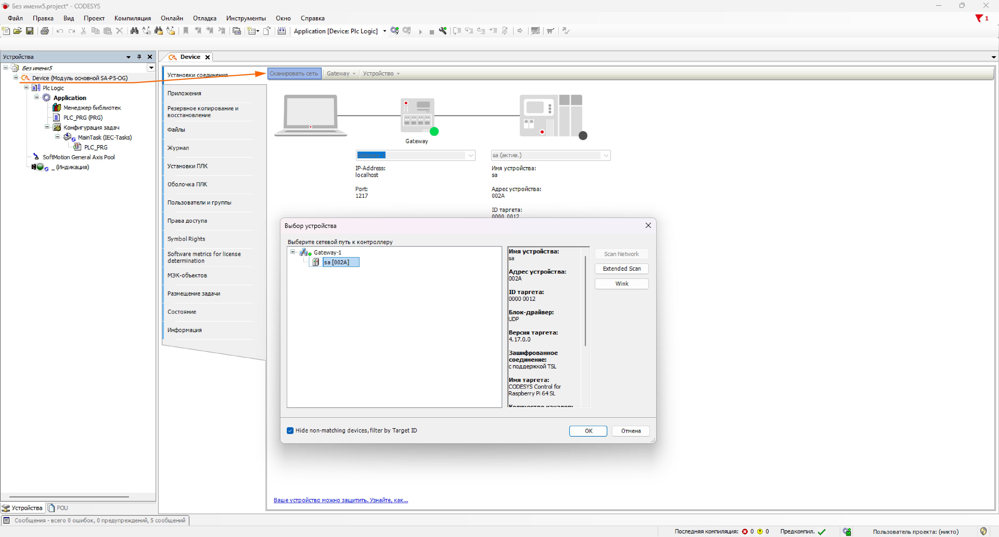

Для загрузки проекта нажмите **Логин**, после чего появится окно с предложением создать пользователя контроллера и задать ему логин и пароль. Эти логин и
пароль потребуется вводить при каждом подключении к виртуальному контроллеру.

    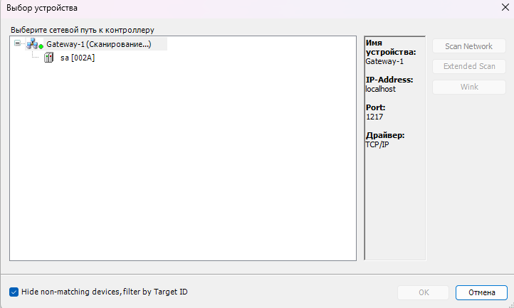

Выполните вход в систему.

    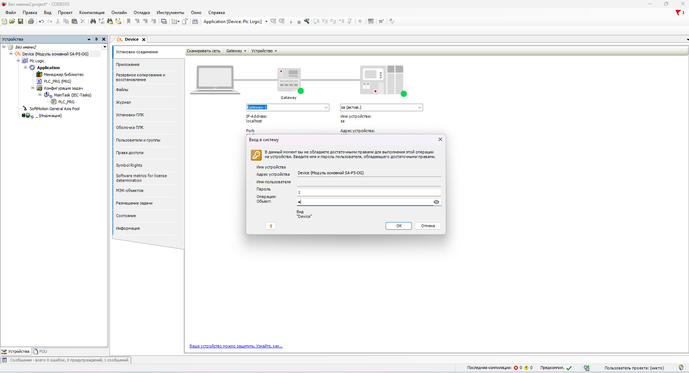

Для продолжения загрузки создайте приложение "Application", ответив **Да** в появившемся окне.

    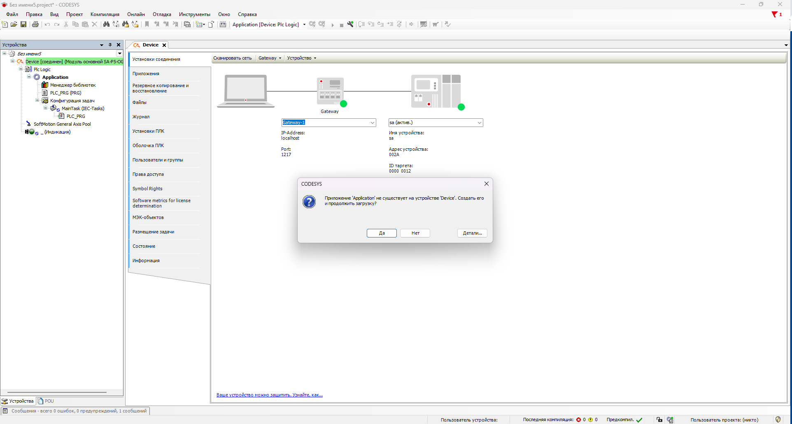

После выполнения команды **Логин** и  входа в систему, проект загружается в контроллер. Для запуска проекта следует выполните команду **Старт**.

Текущее состояние программы отображается в строке состояния CODESYS, расположенной внизу экрана.

    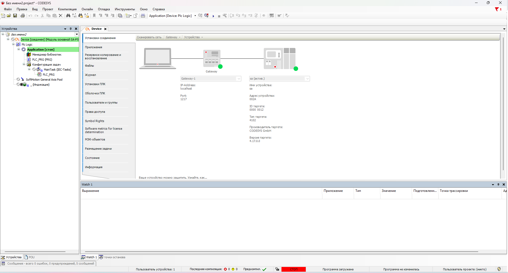

Нажмите на кнопку **Отключение**, которая находится справа от кнопки **Логин**, чтобы добавить устройство.

В дереве проекта правой кнопкой мыши кликните на узел **Device**. В появившемся используйте команду **Добавить устройство**.

    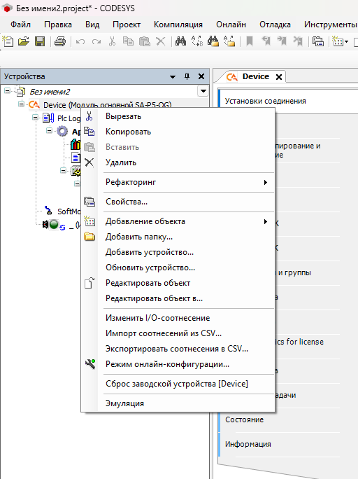

Выберите **EtherCAT Master** и добавьте устройство. 

    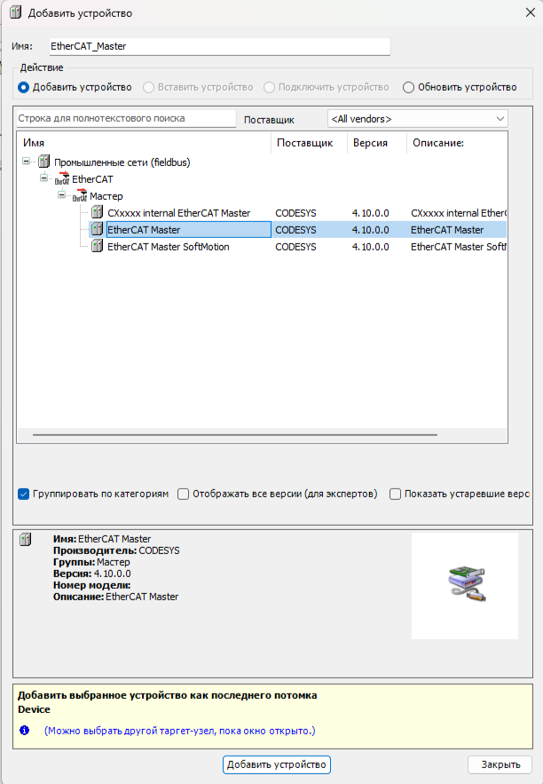

В дереве устройств два раза кликните на **EtherCAT Master**. Нжмите **Select...** и выберете **ecat**. Нажмите **ОК**.

    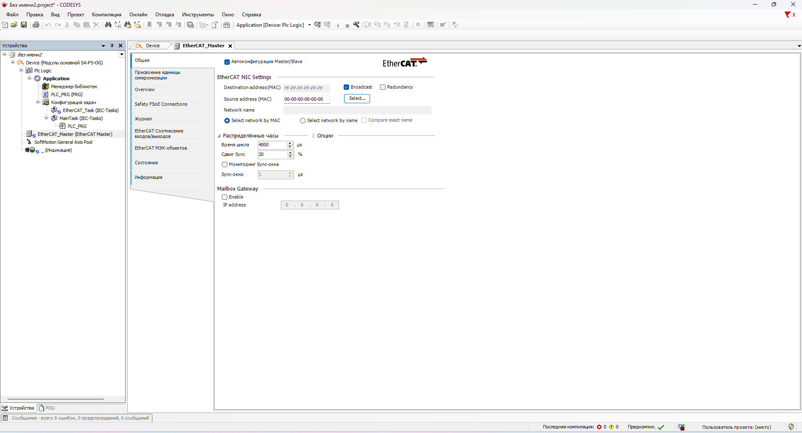

В дереве устройств правой кнопкой мыши щелкните на **EtherCAT Master**. Используйте команду **Поиск устройств...**, чтобы автоматически обнаружить подключенные устройства и добавить их в проект командой **Копировать все устройства в проект**.

    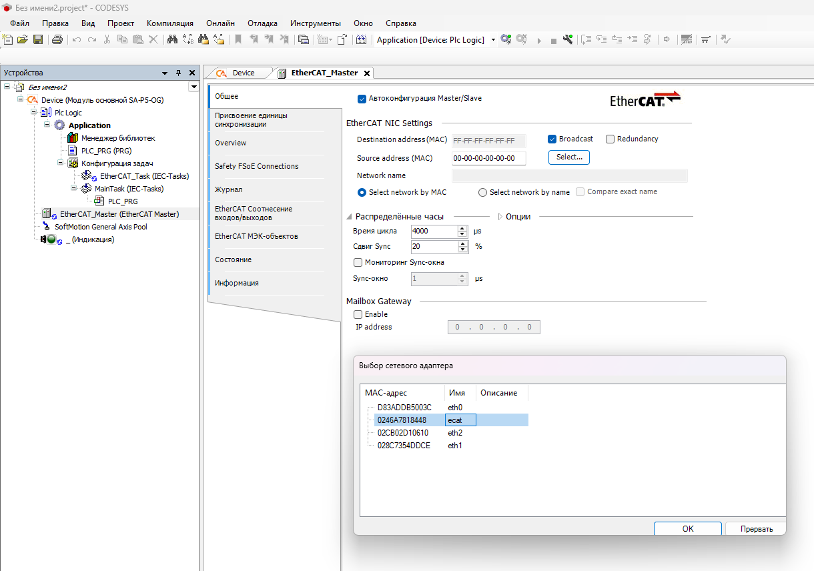

Для того чтобы проверить корректность настройки, в дереве устройств 2 раза кликните на **PLC_PRG**. В открывшейся вкладке, для примера, пропишите краткий код.

Нажмите **Логин**, а затем **Старт**.

    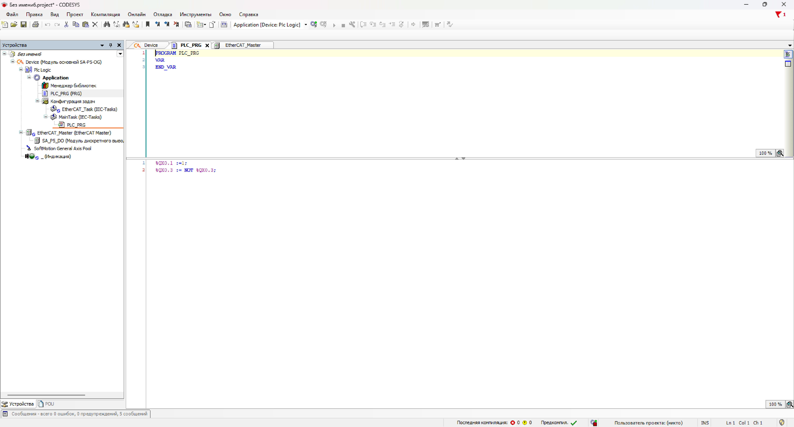

В случае успешной настройки и запуска программы, индикация запущенного приложения в древе проекта должна гореть зеленым.

    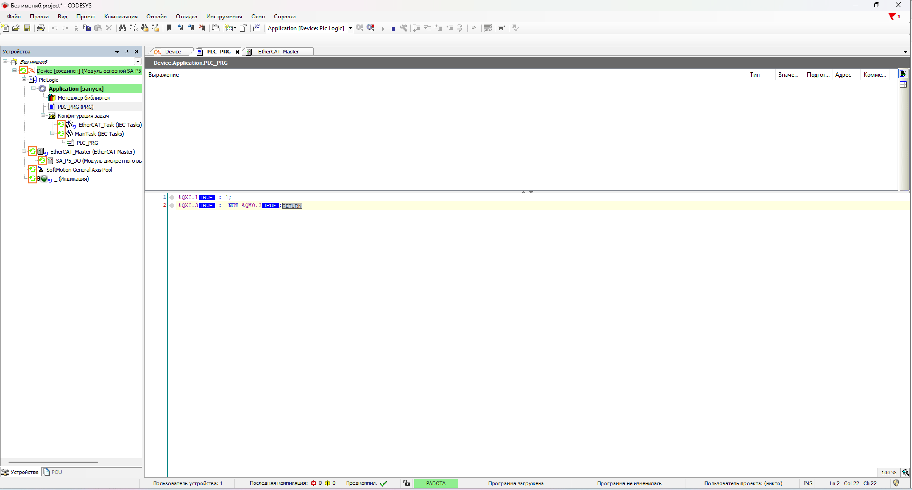

