# Монтаж и демонтаж

## Монтаж модулей на DIN-рейку

!!! Info "Подготовка к монтажу"
    Перед монтажом для контроллера предварительно организуется рабочее место, обеспечивающее защиту от попадания влаги, грязи и посторонних предметов. 
!!! Info ""
    Монтаж модулей осуществляется в вертикальном положении посредством присоединения к стандартной DIN-рейке шириной 35 мм.

Монтаж первого модуля группы осуществляется следующим образом: приставить модуль к DIN-рейке пазом, расположенном на тыльной стороне модуля, после чего зафиксировать, установив верхнюю и нижнюю защелки в положение «закрыто».

    <!-- Первые изображения - видны на сайте -->
    

        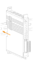
    

    

        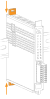
    

    

        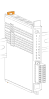
    

<!-- Модальное окно галереи -->

    
    <!-- Кнопка закрытия -->
    

        <button onclick="closeGallery()" style="background: rgba(0,0,0,0.5); color: white; border: 2px solid white; border-radius: 50%; width: 50px; height: 50px; font-size: 24px; cursor: pointer;">×</button>
    

    
    <!-- Кнопка назад -->
    

        <button onclick="prevImage()" style="background: rgba(0,0,0,0.5); color: white; border: 2px solid white; border-radius: 50%; width: 50px; height: 50px; font-size: 24px; cursor: pointer;">‹</button>
    

    
    <!-- Кнопка вперед -->
    

        <button onclick="nextImage()" style="background: rgba(0,0,0,0.5); color: white; border: 2px solid white; border-radius: 50%; width: 50px; height: 50px; font-size: 24px; cursor: pointer;">›</button>
    

    
    <!-- Область изображения -->
    

        
    

    
    <!-- Счетчик изображений -->
    

        1 / 3
    

Монтаж каждого последующего модуля осуществляется путем присоединения его к уже установленному модулю методом шип-паз. Устанавливаемый модуль задвигается вдоль шип-паза до упора к DIN-рейке и фиксируется верхней и нижней защелками в положение «закрыто».

    

        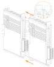
    

    

        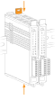
    

    

        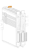
    

<!-- Модальное окно галереи для второй группы -->

    
    <!-- Кнопка закрытия -->
    

        <button onclick="closeGallery2()" style="background: rgba(0,0,0,0.5); color: white; border: 2px solid white; border-radius: 50%; width: 50px; height: 50px; font-size: 24px; cursor: pointer;">×</button>
    

    
    <!-- Кнопка назад -->
    

        <button onclick="prevImage2()" style="background: rgba(0,0,0,0.5); color: white; border: 2px solid white; border-radius: 50%; width: 50px; height: 50px; font-size: 24px; cursor: pointer;">‹</button>
    

    
    <!-- Кнопка вперед -->
    

        <button onclick="nextImage2()" style="background: rgba(0,0,0,0.5); color: white; border: 2px solid white; border-radius: 50%; width: 50px; height: 50px; font-size: 24px; cursor: pointer;">›</button>
    

    
    <!-- Область изображения -->
    

        
    

    
    <!-- Счетчик изображений -->
    

        1 / 3
    

!!! danger "Обратите внимание"
    На первый и последний модули в группе в обязательном порядке ставится заглушка.

## Монтаж подводящих кабелей
!!! Info "Подготовка к монтажу"
    Перед началом работ по подключению необходимо убедиться, что кабели обесточены. 

1. При подключении одножильного провода или многожильного провода с НШВИ подключить провод к клеммной колодке путем надавливания до упора.
2. При подключении многожильного провода без НШВИ надавить на защелку, находящуюся на клеммной колодке напротив нужного разъема, и одновременно подключить провод к клеммной колодке путем ввода до упора.
3. Подключить все необходимые подводящие кабели на каждый модуль.
    <!-- Первая строка из 3 изображений -->
 

    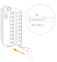
    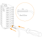
    

<!-- Модальное окно галереи для первой группы -->

    
    <!-- Кнопка закрытия -->
    

        <button onclick="closeGallery3A()" style="background: rgba(0,0,0,0.5); color: white; border: 2px solid white; border-radius: 50%; width: 50px; height: 50px; font-size: 24px; cursor: pointer;">×</button>
    

    
    <!-- Кнопка назад -->
    

        <button onclick="prevImage3A()" style="background: rgba(0,0,0,0.5); color: white; border: 2px solid white; border-radius: 50%; width: 50px; height: 50px; font-size: 24px; cursor: pointer;">‹</button>
    

    
    <!-- Кнопка вперед -->
    

        <button onclick="nextImage3A()" style="background: rgba(0,0,0,0.5); color: white; border: 2px solid white; border-radius: 50%; width: 50px; height: 50px; font-size: 24px; cursor: pointer;">›</button>
    

    
    <!-- Область изображения -->
    

        
    

    
    <!-- Счетчик изображений -->
    

        1 / 3
    

4. Вставить клеммную колодку в специальный разъем на модуле.
5. Затянуть винты клеммной колодки с усилием 0,2 Нм.
6. Для удобства следует зафиксировать провода вместе относительно модуля путем закрепления хомута через ушко корпуса модуля.
<!-- Вторая строка из 3 изображений -->

    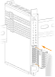
    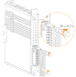
    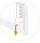

<!-- Модальное окно галереи для второй группы -->

    
    <!-- Кнопка закрытия -->
    

        <button onclick="closeGallery3B()" style="background: rgba(0,0,0,0.5); color: white; border: 2px solid white; border-radius: 50%; width: 50px; height: 50px; font-size: 24px; cursor: pointer;">×</button>
    

    
    <!-- Кнопка назад -->
    

        <button onclick="prevImage3B()" style="background: rgba(0,0,0,0.5); color: white; border: 2px solid white; border-radius: 50%; width: 50px; height: 50px; font-size: 24px; cursor: pointer;">‹</button>
    

    
    <!-- Кнопка вперед -->
    

        <button onclick="nextImage3B()" style="background: rgba(0,0,0,0.5); color: white; border: 2px solid white; border-radius: 50%; width: 50px; height: 50px; font-size: 24px; cursor: pointer;">›</button>
    

    
    <!-- Область изображения -->
    

        
    

    
    <!-- Счетчик изображений -->
    

        1 / 3
    

  Для монтажа кабелей должны выполняться следующие требования: 

- Для обеспечения надёжности электрических соединений рекомендуется использовать только медные провода. 
- При использовании одножильного провода перед соединением необходимо зачистить на длину 12 мм, с таким расчетом, чтобы срез изоляции плотно прилегал к клеммной колодке, т.е. чтобы оголенные участки провода не выступали за ее пределы.
!!! warning "Предупреждение"
    Использование наконечников типа НШВИ длинной менее 12 мм может привести к ненадежной фиксации контактов.
- Для гибкого (многожильного) провода следует использовать наконечники штыревые втулочные изолированные типа НШВИ длиной 12 мм соответствующего сечения кабеля. Допускается монтаж многожильного провода без использования НШВИ, предварительно скрутив жилы провода.
- Максимальное сечение проводов, подключаемых к клеммной колодке при монтаже – 1,5 мм2.
!!! success "Рекомендация"
    Рекомендуемое сечение проводов для подключения к клеммной колодке – 0,5 мм².

## Демонтаж подводящих кабелей 
!!! Info "Подготовка к демонтажу"
    Перед началом работ необходимо убедиться, что кабели обесточены. 
1. Открутить винты на клеммной колодке.
2. Отсоединить клеммную колодку от модуля потянув на себя.
3. Надавить отверткой на защелку оранжевого цвета, расположенной на клеммной колодке напротив демонтируемого кабеля, и одновременно потянуть демонтируемый кабель на себя.

    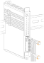
    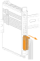
    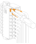

<!-- Модальное окно галереи для четвертой группы -->

    
    <!-- Кнопка закрытия -->
    

        <button onclick="closeGallery4()" style="background: rgba(0,0,0,0.5); color: white; border: 2px solid white; border-radius: 50%; width: 50px; height: 50px; font-size: 24px; cursor: pointer;">×</button>
    

    
    <!-- Кнопка назад -->
    

        <button onclick="prevImage4()" style="background: rgba(0,0,0,0.5); color: white; border: 2px solid white; border-radius: 50%; width: 50px; height: 50px; font-size: 24px; cursor: pointer;">‹</button>
    

    
    <!-- Кнопка вперед -->
    

        <button onclick="nextImage4()" style="background: rgba(0,0,0,0.5); color: white; border: 2px solid white; border-radius: 50%; width: 50px; height: 50px; font-size: 24px; cursor: pointer;">›</button>
    

    
    <!-- Область изображения -->
    

        
    

    
    <!-- Счетчик изображений -->
    

        1 / 3
    

## Демонтаж модулей
Перед демонтажем модуля необходимо убедится, что все подводящие к нему кабели отсоединены, затем с помощью плоской отвертки аккуратно перевести защелки, расположенные снизу и сверху, в положение «открыто». После чего потянуть модуль на себя вдоль шип-пазов до полного отсоединения.
 

    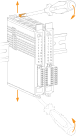
    
    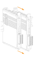

<!-- Модальное окно галереи для пятой группы -->

    
    <!-- Кнопка закрытия -->
    

        <button onclick="closeGallery5()" style="background: rgba(0,0,0,0.5); color: white; border: 2px solid white; border-radius: 50%; width: 50px; height: 50px; font-size: 24px; cursor: pointer;">×</button>
    

    
    <!-- Кнопка назад -->
    

        <button onclick="prevImage5()" style="background: rgba(0,0,0,0.5); color: white; border: 2px solid white; border-radius: 50%; width: 50px; height: 50px; font-size: 24px; cursor: pointer;">‹</button>
    

    
    <!-- Кнопка вперед -->
    

        <button onclick="nextImage5()" style="background: rgba(0,0,0,0.5); color: white; border: 2px solid white; border-radius: 50%; width: 50px; height: 50px; font-size: 24px; cursor: pointer;">›</button>
    

    
    <!-- Область изображения -->
    

        
    

    
    <!-- Счетчик изображений -->
    

        1 / 2
    

