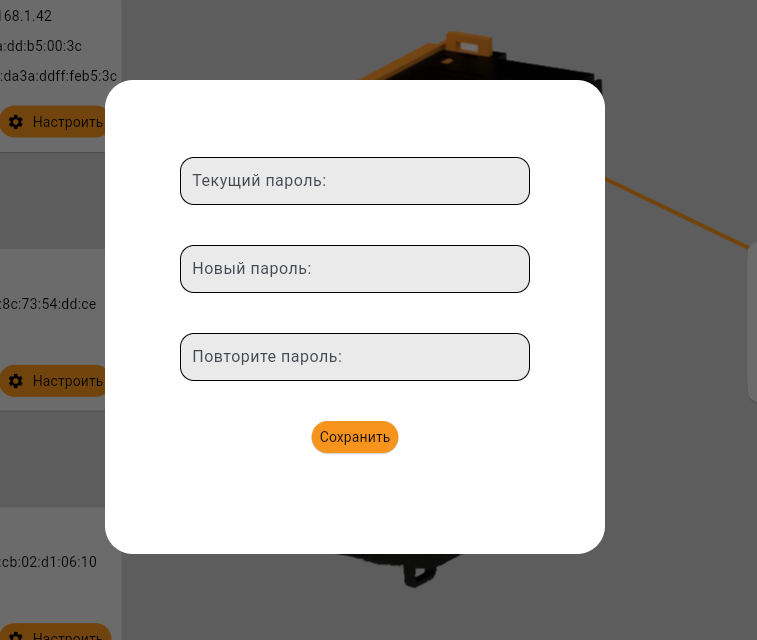

# Подготовка к настройке

Для настройки прибора следуйте следующим пунктам:

1. Соберите модульную группу в соответствии с разделом [Правила сборки](assembly_rules.md).
2. Подайте питание на Модуль ввода питания SPPM по [схеме подключения](SPPM.md#_4) и убедитесь, что индикаторы питания на всех модулях горят зеленым светом.
3. Подключите контроллер к сети Ethernet одним из следующих способов:

    **Способ 1: Прямое подключение к ПК**

    Соедините сетевой кабель портом Eth0 на основном модуле и сетевым портом вашего компьютера.

    Настройте сетевой адрес ПК:

    - Перейдите в настройки компьютера, в раздел «Сеть и Интернет».
    - Откройте «Свойства» сетевого подключения.
    - В пункте «Назначение IP» выберите ручной метод настройки и активируйте переключатель IPv4.
    - В открывшейся форме задайте следующие параметры:

    !!! note "Примечание"
        IP-адрес задается следующим образом: `192.168.1.Х`, где `Х` — любое число от 2 до 254, кроме 42.

    

    

    
    

    **Способ 2: Подключение через сетевую инфраструктуру**

    Подключите сетевой кабель к порту Eth1 или Eth2 контроллера, а другой конец - к коммутатору или роутеру в сети с настроенным DHCP-сервером.

4. Для входа в веб-интерфейс управления:

    - Откройте браузер и в адресной строке введите: `http://sa.local`
    - В открывшемся окне авторизации введите: **Логин** - `sa` и **Пароль** - `sa`

5. После первой авторизации смените пароль:

    - Нажмите на иконку профиля в правом верхнем углу.
    - В выпадающем меню выберите пункт «Профиль».

    

    
    

   <ul style="margin-left: 45px;">
<li>В открывшемся окне введите текущий пароль, задайте и подтвердите новый пароль, затем нажмите кнопку «Сохранить изменения».</li>
</ul>

    
    

