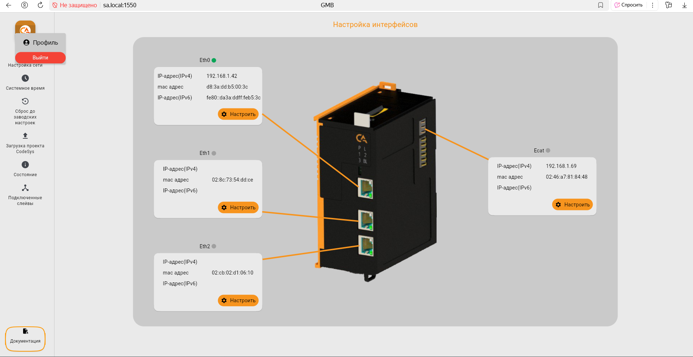

# Подготовка к настройке

Для настройки прибора следуйте следующим пунктам:

 1. Соберите модульную группу в соответствии с разделом [Правила сбоки](assembly_rules.md).
 2. Подайте питание на Модуль ввода питания SPPM по [схме подключения](SPPM.md#_4) и убедитесь, что индикаторы питания на всех модулях горят зеленым светом.
 3. Подключите контроллер к сети Ethernet одним из следующих способов:
  
     Способ 1: Прямое подключение к ПК

     Соедините сетевой кабель портом Eth0 на основном модуле и сетевым портом вашего компьютера.

     Настройте сетевой адрес ПК:
     
    * Перейдите в настройки компьютера, в раздел «Сеть и Интернет».
    * Откройте «Свойства» сетевого подключения.
    * В пункте «Назначение IP» выберите ручной метод настройки и активируйте переключатель IPv4.
    * В открывшейся форме задайте следующие параметры:
    
        !!! note "Примечание"
            IP-адрес задается следующим образом: `192.168.1.Х`, где `Х` — любое число от 2 до 254, кроме 42. 

         { width="280" style="display: block; margin-left: auto; margin-right: auto; cursor: pointer;" onclick="this.style.transform=this.style.transform=='scale(2)'?'scale(1)':'scale(2)';this.style.zIndex=this.style.zIndex=='1000'?'auto':'1000'" }

     Способ 2: Подключение через сетевую инфраструктуру

     Подключите сетевой кабель к порту Eth1 или Eth2 контроллера, а другой конец - к коммутатору или роутеру в сети с настроенным DHCP-сервером.
  
  4. Для входа в веб-интерфейс управления:

    * Откройте браузер и в адресной строке введите: http://sa.local
    * В открывшемся окне авторизации введите: Логин-sa и Пароль-sa

  5. После первой авторизации смените пароль:
    
    * Нажмите на иконку профиля в правом верхнем углу.
    * В выпадающем меню выберите пункт «Профиль».

        { width="700" style="display: block; margin-left: auto; margin-right: auto; cursor: pointer;" onclick="this.style.transform=this.style.transform=='scale(2)'?'scale(1)':'scale(2)';this.style.zIndex=this.style.zIndex=='1000'?'auto':'1000'" }

    * В открывшемся окне введите текущий пароль, задайте и подтвердите новый пароль, затем нажмите кнопку «Сохранить изменения».

        { width="300" style="display: block; margin-left: auto; margin-right: auto; cursor: pointer;" onclick="this.style.transform=this.style.transform=='scale(2)'?'scale(1)':'scale(2)';this.style.zIndex=this.style.zIndex=='1000'?'auto':'1000'" }

