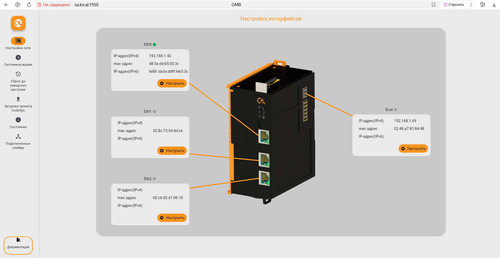

# Web-интерфейс
## Настройка интерфейсов

    
    

При переходе в веб-интерфейс на экране отображается раздел "Нстройка сети", где представлены текущие параметры всех сетевых интерфейсов. Каждый интерфейс сопоставлен с физическим портом на основном модуле и имеет кнопку "Настроить" для изменения параметров.  

    
    

Для настройки сетевого интерфейса можно выбрать как автоматический режим присвоения сетевых параметров с помощью DHCP, так и вводить их вручную. 

## Системное время

    
    

В данном разделе Вы можете настроить системное время устройства: выбрать часовой пояс и включать автоматическую синхронизацию времени через NTP-сервер.

В поле "NTP-серверы" можно указать один или несколько адресов NTP-серверов.

!!! note "Примечание"
      Рекомендуется настроить синхронизацию времени при помощи NTP.
     
После завершения настройки времени сохраните изменения.

## Сброс до заводских настроек

??? example "Разработка"

    На текущий момент данный раздел находится в разработке.

Сброс до заводских настроек осуществляется при помощи скрытой кнопки на [Модуле основном GMB](GMB.md).
