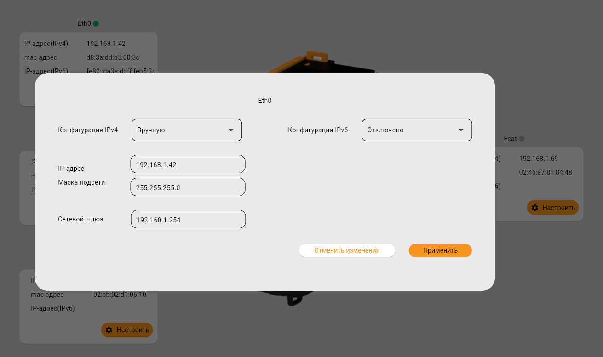
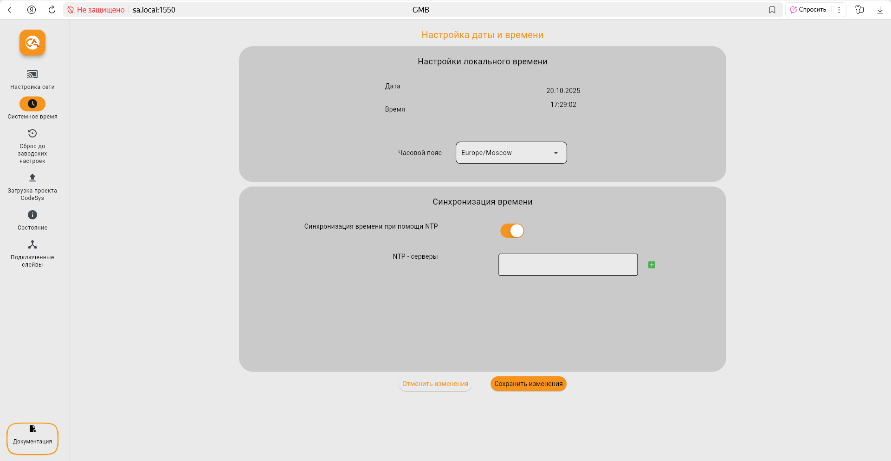

# Web-интерфейс
## Настройка интерфейсов

{ .fullscreen-image width="700" style="display: block; margin-left: auto; margin-right: auto; cursor: zoom-in;" }

При переходе в веб-интерфейс на экране отображается раздел "Нстройка сети", где представлены текущие параметры всех сетевых интерфейсов. Каждый интерфейс сопоставлен с физическим портом на основном модуле и имеет кнопку "Настроить" для изменения параметров.  

{ .fullscreen-image width="700" style="display: block; margin-left: auto; margin-right: auto; cursor: zoom-in;" }

Для настройки сетевого интерфейса можно выбрать как автоматический режим присвоения сетевых параметров с помощью DHCP, так и вводить их вручную. 

## Системное время

{ .fullscreen-image width="700" style="display: block; margin-left: auto; margin-right: auto; cursor: zoom-in;" }

В данном разделе Вы можете настроить системное время устройства: выбрать часовой пояс и включать автоматическую синхронизацию времени через NTP-сервер.

В поле "NTP-серверы" можно указать один или несколько адресов NTP-серверов.

!!! note "Примечание"
      Рекомендуется включить NTP-синхронизацию, чтобы обеспечить точность времени.
     
После завершения настройки времени сохраните изменения.

## Сброс до заводских настроек

??? example "Разработка"

    На текущий момент данный раздел находится в разработке.

Сброс до заводских настроек осуществляется при помощи скрытой кнопки на [Модуле основном GMB](GMB.md).
